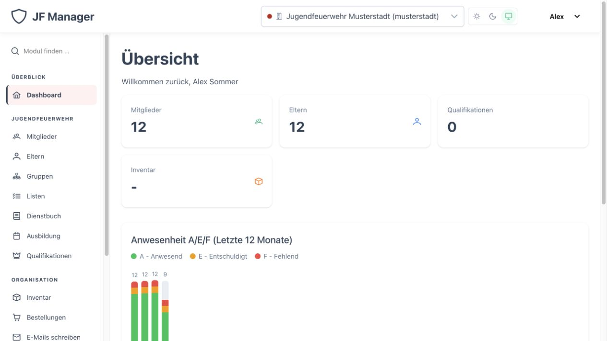
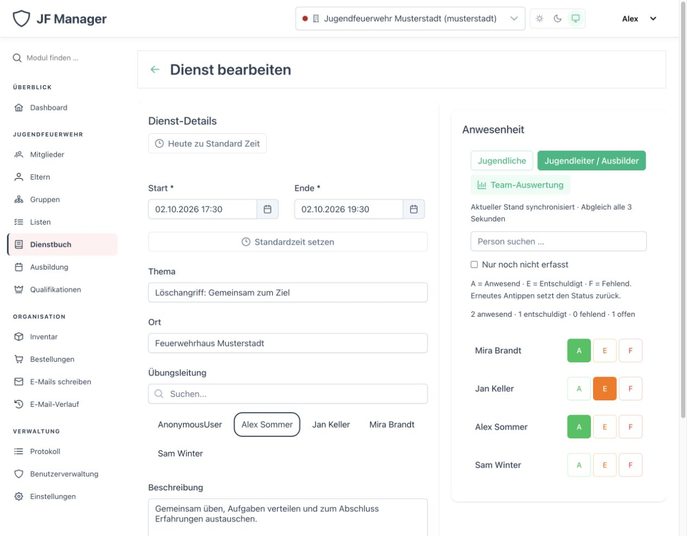
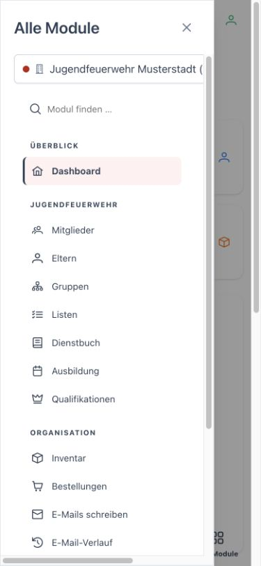
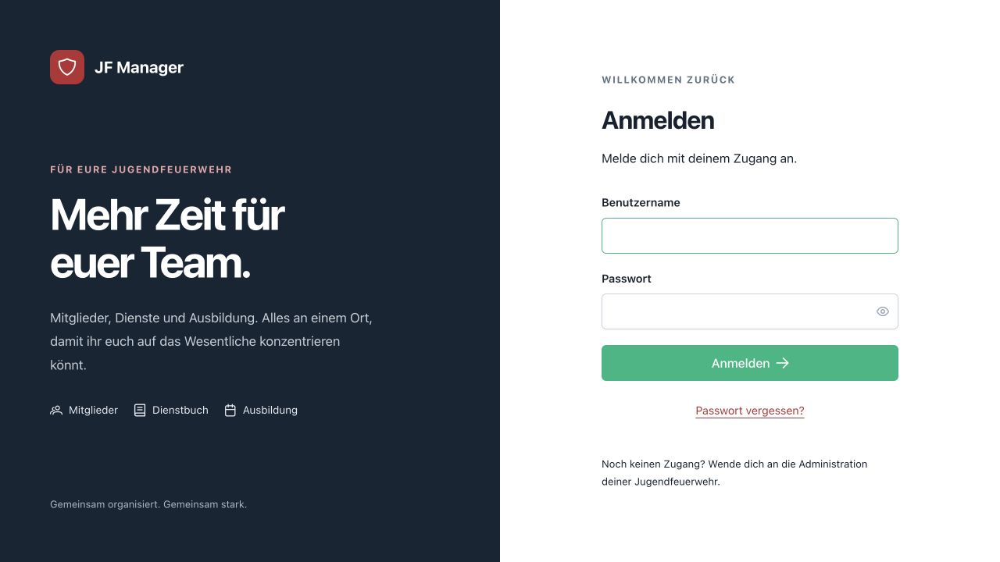
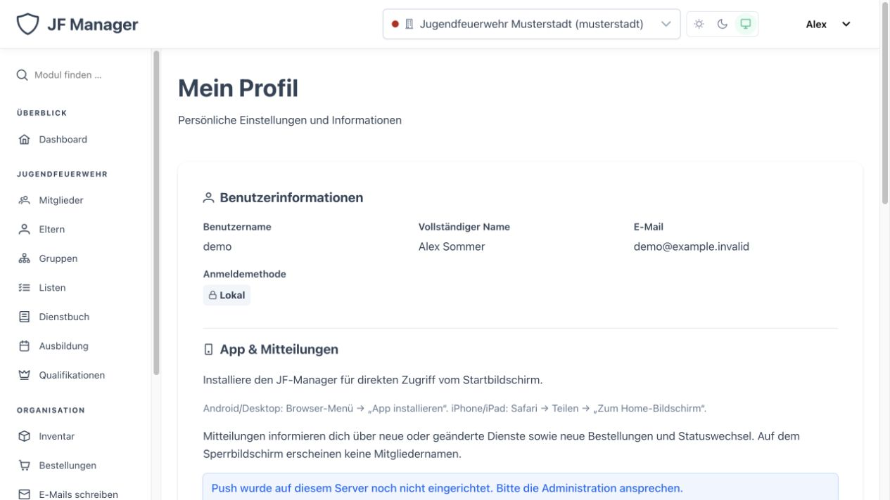

# JF-Manager

**Mehr Zeit für eure Jugendfeuerwehr.** JF-Manager bringt Mitglieder, Eltern, Dienste, Ausbildung und Ausstattung an einen Ort. Jugendleiterinnen und Jugendleiter können Anwesenheiten gemeinsam erfassen; die Anwendung ist auf dem Smartphone als Web-App installierbar.



Die Abbildungen stammen aus einer eigens erzeugten Demo mit **ausschließlich fiktiven Daten**. [Benutzerhandbuch](docs/user-guide.md) · [Installation](#installation) · [Mitmachen](CONTRIBUTING.md)

## Was ihr damit erledigt

| Alltag | Im JF-Manager |
| --- | --- |
| Mitglieder begleiten | Stammdaten, Gruppen, Elternkontakte, Notizen, Anhänge und auswählbare Excel-Exporte |
| Dienste dokumentieren | Termine, Themen, Übungsleitung, besondere Vorkommnisse und Anwesenheiten |
| Gemeinsam abhaken | Jugendliche und Betreuungspersonen getrennt erfassen; Änderungen einzelner Personen sofort speichern und alle drei Sekunden abgleichen |
| Betreuungsarbeit auswerten | Anwesenheit von Jugendleitern/Ausbildern nach Zeitraum und geleisteten Stunden auswerten |
| Ausbildung planen | Ausbildungskalender, wiederkehrende Termine, Planer, Bausteinbibliothek und Handouts |
| Ausstattung verwalten | Inventar, Lagerorte, Ausleihen, Barcode-Erfassung und Bestellabläufe |
| Kommunikation organisieren | Listen mit Check-Workflow, E-Mails, Versandhistorie und Benachrichtigungen für Dienst- und Bestellereignisse |
| Verantwortlichkeiten abbilden | Abteilungen, Rollen, Qualifikationen, Sonderaufgaben, LDAP und OIDC-SSO |

Die Modulnavigation ist auf dem Desktop dauerhaft sichtbar und durchsuchbar. Mobil führen **Module** und **Alle Module** zur vollständigen Übersicht.



Beim Abhaken wird nur die ausgewählte Person gespeichert. Bearbeiten zwei Personen gleichzeitig denselben Eintrag, fordert die Anwendung zur Prüfung des aktuellen Stands auf. Die Team-Auswertung zählt anwesend, entschuldigt und fehlend sowie Stunden aus der Dienstdauer. [Schrittweise Anleitung im Handbuch](docs/user-guide.md#dienstbuch-und-gemeinsame-anwesenheitserfassung)



Die Web-App lässt sich unter HTTPS zum Startbildschirm hinzufügen. Push-Mitteilungen werden **pro Gerät freiwillig** im Profil aktiviert; wählbar sind Dienste und Bestellungen. Der Sperrbildschirm zeigt allgemeine Hinweise ohne Mitgliedernamen. Für Datenzugriff und Änderungen ist eine Internetverbindung nötig. [Einrichtung und technische Grenzen](docs/push-and-pwa.md)

## Installation

Für den eigenen Server braucht ihr Docker Compose, eine PostgreSQL-Datenbank (im Compose enthalten), einen öffentlichen Hostnamen und für die installierbare Web-App eine HTTPS-Verbindung. Die mitgelieferte Compose-Konfiguration enthält Backend, Frontend, Datenbank, Redis und einen Push-Versandprozess. Vor dem Einsatz mit echten Mitgliederdaten [Sicherheitsupdate und bekannte Mediengrenze](docs/security-upgrade.md) lesen.

```sh
git clone https://github.com/Jugendfeuerwehr-Manager/JF-Manager.git
cd JF-Manager
cp .env.example .env
```

In `.env` mindestens `POSTGRES_PASSWORD`, `DJANGO_SECRET_KEY`, `DJANGO_ADMIN_PASSWORD`, `DJANGO_ADMIN_EMAIL`, `ALLOWED_HOSTS` und `CSRF_TRUSTED_ORIGINS` für eure Domain setzen. Danach:

```sh
docker compose up -d --build
docker compose ps
```

Die Anwendung ist zunächst am konfigurierten HTTP-Port erreichbar. Für öffentliches Hosting TLS am vorgeschalteten Reverse Proxy einrichten und die tatsächliche HTTPS-Domain in der Konfiguration hinterlegen. Mobile Installation und Push benötigen einen sicheren Ursprung; Push wird erst nach [VAPID-Konfiguration](docs/push-and-pwa.md) aktiv. Die Datenbankmigrationen laufen im Backend-Einstiegspunkt; beim Aktualisieren zusätzlich die Schritte im [Sicherheitsupdate](docs/security-upgrade.md) beachten. Ausführliche Varianten: [Docker](docs/deployment/docker.md), [Portainer](portainer/README.md) und [Betrieb](docs/getting-started.md).

## Ausprobieren mit Beispieldaten

Die lokale Demo erzeugt eine **neue temporäre SQLite-Datenbank** mit zwölf fiktiven Mitgliedern, vier Betreuungspersonen und Beispieldiensten. Sie benutzt weder die vorhandene Anwendungsdatenbank noch echten E-Mail- oder Push-Versand. Voraussetzungen sind Python 3.10+, Pipenv und Node.js 20.19+ beziehungsweise 22.12+.

```sh
cd backend
pipenv install
pipenv run python demo.py --port 8011
```

Benutzername und zufälliges Demopasswort erscheinen im Terminal. In einem zweiten Terminal:

```sh
cd frontend
npm ci
VITE_BACKEND_URL=http://127.0.0.1:8011 npm run dev
```

Anschließend `http://localhost:5173` öffnen. Die Demo lauscht nur lokal. Für die reguläre Entwicklung stehen [Startanleitung](docs/getting-started.md) und `./start-dev.sh` bereit.

## Einstieg für das Team

1. Persönlich anmelden; bei eingerichtetem SSO den entsprechenden Knopf verwenden.
2. Die richtige Abteilung auswählen und über die Modulnavigation **Mitglieder** und **Dienstbuch** öffnen.
3. Einen Dienst speichern, anschließend Jugendliche und Betreuungspersonen im Anwesenheitsbereich erfassen.
4. Im Profil die Standard-Abteilung, E-Mail-Signatur sowie Installation und Mitteilungen verwalten.





Das [Benutzerhandbuch](docs/user-guide.md) erläutert alle Module mit praktischen Abläufen. Die [Architektur](docs/architecture/overview.md), [API-Referenz](docs/api/reference.md) und [Entwicklungsdokumentation](docs/development/build-pipeline.md) helfen bei Erweiterungen.

## Technik und Qualität

Das Backend verwendet Django 5 und Django REST Framework, das Frontend Vue 3, TypeScript und PrimeVue. PostgreSQL dient als Produktionsdatenbank, Redis als gemeinsamer Cache; Docker Compose stellt die Dienste bereit. Zugriffsrechte werden für Benutzer, Abteilungen und einzelne API-Routen geprüft. Dieses Update schließt insbesondere fremde Profiländerungen, Rechteausweitung über Benutzer-Routen und wiederverwendbare Passwort-Reset-Links. [Betriebs- und Migrationshinweise](docs/security-upgrade.md)

```sh
cd backend && PIPENV_DONT_LOAD_ENV=1 DJANGO_SECRET_KEY=local-test-only-secret-key-32-chars REDIS_URL=none pipenv run python manage.py test api_tests users departments.tests servicebook.tests.test_attendance_board servicebook.tests.test_attendance_by_member servicebook.tests.test_attendance_race_condition notifications
cd ../frontend && npm run build && npm run test:unit -- --run
```

JF-Manager ist unter der [GNU Affero General Public License](backend/LICENSE) veröffentlicht. Beiträge sind willkommen: [CONTRIBUTING.md](CONTRIBUTING.md).
