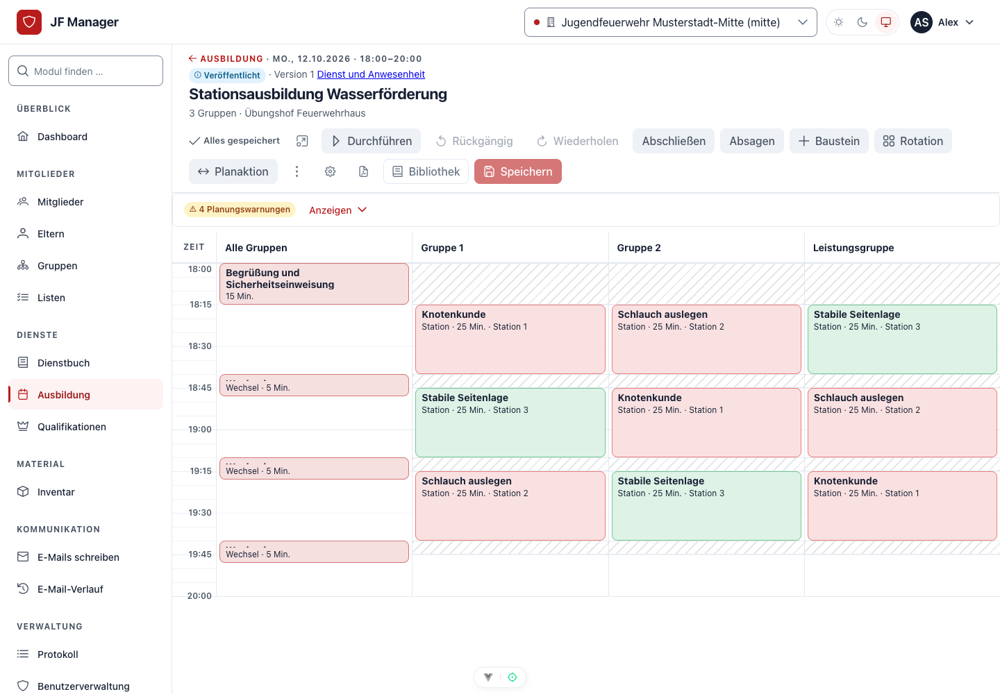

# JF-Manager

**Mehr Zeit für euer Team.** JF-Manager verbindet Mitglieder, Elternkontakte, Dienste, Ausbildung und Ausstattung. Entwickelt für Jugendfeuerwehren, unterstützt die Anwendung auch Organisationen mit mehreren Abteilungen und anderen Teamstrukturen. Die drei Modulnamen für Mitglieder, Dienstbuch und Ausbildung lassen sich anpassen.


*Aktuelle Oberfläche vom 8. Oktober 2026, aufgenommen in einer isolierten Demo mit ausschließlich fiktiven Daten.*

## Benutzerhandbuch

Das bebilderte Handbuch erklärt Grundkonzepte und führt schrittweise durch die Aufgaben. Es ist direkt auf GitHub lesbar und als statische Website mit deutscher Suche, Rollennavigation und Druckansicht auslieferbar.

| Für wen? | Einstieg |
| --- | --- |
| Alle, die neu beginnen | [Grundlegende Konzepte](docs/handbook/concepts.md) und [Anmelden / mobile Bedienung](docs/handbook/operators/start.md) |
| Jugendleiter / Bediener | [Mitglieder, Dienstbuch, Übungsplanung, Material und Kommunikation](docs/handbook/operators/index.md) |
| Administratoren | [Organisation, Konten, Rollen, Einstellungen und Integrationen](docs/handbook/administrators/index.md) |
| Server & Operations | [Installation, Regelbetrieb, Sicherung und Notfälle](docs/handbook/server/index.md) |

[Gesamtes Handbuch](docs/handbook/index.md) · [Website/ZIP bauen und GitHub Pages einrichten](docs/handbook/publishing.md) · [Technische Dokumentation](docs/README.md)

## Was ihr damit erledigt

| Aufgabe | Funktionen |
| --- | --- |
| Mitglieder begleiten | Stammdaten, Elternkontakte, Gruppen, Notizen, geschützte Anhänge und berechtigte Exporte |
| Dienste dokumentieren | Termine, Themen, Übungsleitung, Vorkommnisse und Anwesenheiten für Teilnehmende und Team |
| Gemeinsam erfassen | Sofortiges Speichern je Person, regelmäßiger Abgleich und Konflikthinweise |
| Teilnahme auswerten | Eigene Dienstbuch-Auswertung mit Zeitraum, Quote, Stunden, Monatsverlauf und Hinweisen |
| Ausbildung organisieren | Kalender, Bausteinbibliothek, Stationen, Rotation, Ressourcenwarnungen, Serien und Vorlagen |
| Übungen durchführen | Mobile Durchführung, Stationsansicht, Handouts mit Materialliste und Nachbereitung |
| Ausstattung verwalten | Artikel/Varianten, Lager, Bestände, Ausleihen, Einkleidung, Gegenbuchungen und Bestellungen |
| Nachweise verfolgen | Qualifikationen, Gültigkeit und Sonderaufgaben |
| Kommunizieren | Empfängerauswahl, E-Mail-Vorschau, Vorlagen, Versandhistorie und freiwillige Gerätemitteilungen |
| Zuständigkeiten regeln | Abteilungsrechte, 16 Standardrollen, Wirkungsvorschau, Delegation, LDAP und OIDC-SSO |

Bestellungen findet ihr unter **Inventar → Bestellungen**, im Dashboard oder per Direktlink. Die **Anwesenheitsauswertung** ist eine eigene Seite im Dienstbuch. Ein Mitglieds-/Elterndatensatz ist kein Benutzerkonto. Eltern-/Mitgliederportal und erweiterte Teilnahmesteuerung befinden sich noch in Entwicklung und sind im Handbuch als solche gekennzeichnet.



*Der Planer sammelt Änderungen als Entwurf. Materialbedarf erzeugt keine Bestandsbuchung oder Reservierung.*

Die Web-App lässt sich unter HTTPS zum Startbildschirm hinzufügen. Push-Mitteilungen für Dienste und Bestellungen werden pro Gerät freiwillig aktiviert. Datenzugriff und Änderungen brauchen eine Internetverbindung; es gibt keine Warteschlange für Offline-Änderungen. [Mobile Einrichtung](docs/handbook/operators/start.md#auf-dem-smartphone-installieren)

## Installation und Betrieb

Unterstützt werden **Docker Compose** mit vorgebauten Releaseimages und **Debian 13 nativ**, auch im Proxmox-LXC. Beide Wege verwenden `jfctl`. HTTPS wird mit Caddy eingerichtet oder über einen vorhandenen Reverse Proxy betrieben. Fachliche Einstellungen verwaltet ihr in der Weboberfläche.

1. [Produktionsvorgaben](docs/operations/production-security.md) und [Installationsanleitung](docs/operations/ops-install.md) lesen.
2. Das gewünschte [Release](https://github.com/Jugendfeuerwehr-Manager/JF-Manager/releases) auswählen und dessen Paket, Manifest und Prüfsummen auf Verfügbarkeit prüfen.
3. Im folgenden Beispiel `X.Y.Z` durch diese Version ersetzen und den Installationsassistenten ausführen:

```sh
VERSION=X.Y.Z
BASE=https://github.com/Jugendfeuerwehr-Manager/JF-Manager/releases/download/v$VERSION
curl -fsSLO "$BASE/jf-manager-$VERSION.tar.gz" -O "$BASE/SHA256SUMS" -O "$BASE/release-manifest.json"
sha256sum -c SHA256SUMS && tar -xzf "jf-manager-$VERSION.tar.gz"
sudo "./jf-manager-$VERSION/ops/jfctl" install --version "$VERSION" --release-dir .
```

Der Assistent sammelt Angaben, prüft das System und zeigt vor der Installation eine Zusammenfassung. Danach:

```sh
sudo jfctl status
sudo jfctl doctor
sudo jfctl backup create
sudo jfctl backup verify latest
```

[Befehlsreferenz](docs/operations/ops-jfctl.md) · [Backup, Restore und Updates](docs/operations/ops-backup-restore-update.md) · [Migration von Portainer/Compose/Synology](docs/operations/ops-migration.md)

`dev/` enthält ausschließlich Entwicklungscontainer. Produktivänderungen und Updates laufen über `jfctl`; bestehende Installationen werden nach der Migrationsanleitung übernommen.

## Lokal mit fiktiven Daten ausprobieren

Die Demo erstellt eine **neue temporäre SQLite-Datenbank**, isolierte Uploads und eigene Schlüssel. Sie verwendet keine vorhandene Anwendungsdatenbank und verschickt keine echten E-Mails oder Push-Nachrichten. Der aktuelle Seed enthält drei Abteilungen, 53 Mitglieder, Dienste, Übungen, Ausstattung und mehrere Testrollen.

Voraussetzungen: Python 3.12+, Pipenv und Node.js 20.19+ beziehungsweise 22.12+.

```sh
cd backend
pipenv install
PIPENV_DONT_LOAD_ENV=1 pipenv run python demo.py --port 8011
```

In einem zweiten Terminal:

```sh
cd frontend
npm ci
VITE_BACKEND_URL=http://127.0.0.1:8011 npm run dev
```

Öffne die vom Frontend gemeldete lokale Adresse. Das Demo-Terminal nennt Konten, zufälliges Passwort und den Befehl für den aktuellen Authenticator-Code. Für das Administrationskonto ist der Demo-Faktor bereits eingerichtet. Die Demo lauscht nur lokal. Weitere Entwicklung: [Startanleitung](docs/getting-started.md), `./start-dev.sh` und die VS-Code-Konfigurationen. [Screenshots reproduzieren](docs/handbook/publishing.md#aktuelle-screenshots-erzeugen)

## Handbuch als Website und ZIP bauen

Im Repository-Wurzelverzeichnis:

```sh
python3 -m venv .venv-docs
.venv-docs/bin/python -m pip install -r requirements-docs.txt
.venv-docs/bin/python scripts/docs/build.py
```

Das Ergebnis liegt unter `.docs-build/site/`; `.docs-build/jf-manager-handbook.zip` enthält die auslieferbare Website. Der Build prüft interne Links, Anker und Assets. Für eine lokale Vorschau mit funktionierender Suche:

```sh
.venv-docs/bin/python -m http.server 8088 --bind 127.0.0.1 --directory .docs-build/site
```

Der Workflow **Benutzerhandbuch** erstellt bei Dokumentationsänderungen ein Artefakt; GitHub Pages wird nur durch einen ausdrücklich gestarteten Veröffentlichungslauf auf `main` aktiviert. [Auslieferung und Pflege](docs/handbook/publishing.md)

## Entwicklung und Mitmachen

Backend: Django 5.2 und Django REST Framework; Frontend: Vue 3, TypeScript, Pinia und PrimeVue. Produktion: PostgreSQL 17 und Redis. Anmeldung: serverseitige Cookie-Sitzungen mit CSRF, MFA und Passkeys. Fachliche Rechte werden für Aktion und tatsächliche Abteilung geprüft.

[Architektur](docs/architecture/overview.md) · [API](docs/api/reference.md) · [Testanleitung](docs/development/testing.md) · [CONTRIBUTING.md](CONTRIBUTING.md)

JF-Manager ist unter der [GNU Affero General Public License](backend/LICENSE) veröffentlicht. Beiträge sind willkommen.
