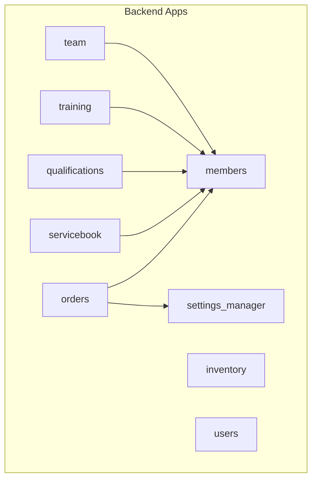
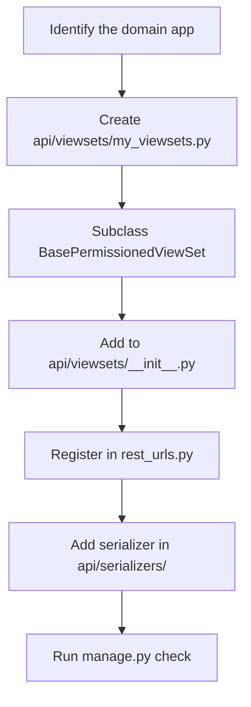

# Backend Architecture

## App Structure

Every Django app follows the same modular layout. The `orders` app is the **reference implementation**.

```
backend/{app}/
├── api/
│   ├── viewsets/          # DRF ViewSets (one file per domain concept)
│   │   ├── __init__.py    # Re-exports all ViewSets
│   │   └── *.py
│   ├── serializers/       # DRF Serializers (one file per domain concept)
│   │   ├── __init__.py    # Re-exports all Serializers
│   │   └── *.py
│   ├── filters.py         # django-filter FilterSets
│   └── permissions.py     # Custom DRF permissions (if needed)
├── models/                # Django ORM models
├── migrations/            # Django migrations
├── admin.py               # Django Admin registrations
└── apps.py
```

> **Legacy pattern** (`views.py`, `api_views.py`, `serializers.py` at app root) — still present in some apps, being phased out. Do **not** add new code there.

## App Overview



## URL Registration

All ViewSets are registered in a **single router** at `jf_manager_backend/rest_urls.py`. Individual apps do **not** define their own API URL files.

```
/api/v1/
  orders/              → OrderViewSet
  order-items/         → OrderItemViewSet
  orderable-items/     → OrderableItemViewSet
  order-statuses/      → OrderStatusViewSet
  members/             → MemberViewSet
  parents/             → ParentViewSet
  member-statuses/     → StatusViewSet
  member-groups/       → GroupViewSet
  events/              → EventViewSet
  event-types/         → EventTypeViewSet
  attachments/         → AttachmentViewSet
  inventory/items/     → ItemViewSet
  inventory/categories/→ CategoryViewSet
  inventory/variants/  → ItemVariantViewSet
  inventory/locations/ → StorageLocationViewSet
  inventory/stock/     → StockViewSet
  inventory/transactions/ → TransactionViewSet
  qualifications/      → QualificationViewSet
  qualification-types/ → QualificationTypeViewSet
  special-tasks/       → SpecialTaskViewSet
  users/me/            → UserViewSet
```

## Authentication & Permissions


### Shared Mixins (`jf_manager_backend/mixins.py`)

| Mixin | Authentication | Permission | Filters |
|---|---|---|---|
| `BaseFilterMixin` | — | — | DjangoFilter, Search, Ordering |
| `BaseAuthViewSet` | IsAuthenticated | — | All three |
| `BasePermissionedViewSet` | IsAuthenticated | CustomDefaultPermissions | All three |

Use `BasePermissionedViewSet` for all new endpoints unless the endpoint is intentionally read-only for any authenticated user.

## How to Add a New Endpoint



**Minimal ViewSet template:**

```python
from jf_manager_backend.mixins import BasePermissionedViewSet
from myapp.models import MyModel
from myapp.api.serializers import MyModelSerializer

class MyModelViewSet(BasePermissionedViewSet):
    queryset = MyModel.objects.all()
    serializer_class = MyModelSerializer
```

## Serializer Selection Pattern

When different actions need different amounts of data, use `get_serializer_class()`:

```python
def get_serializer_class(self):
    if self.action == 'list':
        return MyModelListSerializer    # minimal, fast
    elif self.action == 'create':
        return MyModelCreateSerializer  # validation rules
    return MyModelDetailSerializer      # full fields (retrieve, update)
```

## Custom Actions

ViewSet `@action` decorators create extra endpoints automatically:

```python
@action(detail=True, methods=['get'])
def export_excel(self, request, pk=None):
    # Creates: GET /api/v1/members/{id}/export_excel/
    ...

@action(detail=False, methods=['post'])
def send_summary(self, request):
    # Creates: POST /api/v1/orders/send_summary/
    ...
```

## Pagination

All list endpoints return paginated data. The default page size is defined in `settings.py` under `REST_FRAMEWORK.PAGE_SIZE`.

```json
{
  "count": 42,
  "next": "http://localhost:8000/api/v1/members/?page=2",
  "previous": null,
  "results": [...]
}
```

Always use `.results` when consuming lists in the frontend.
