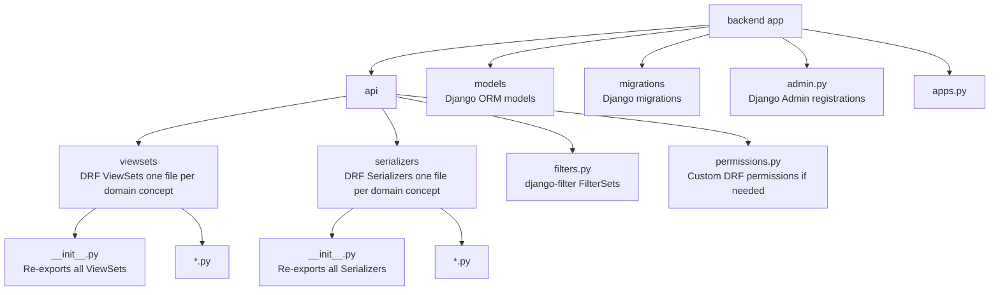
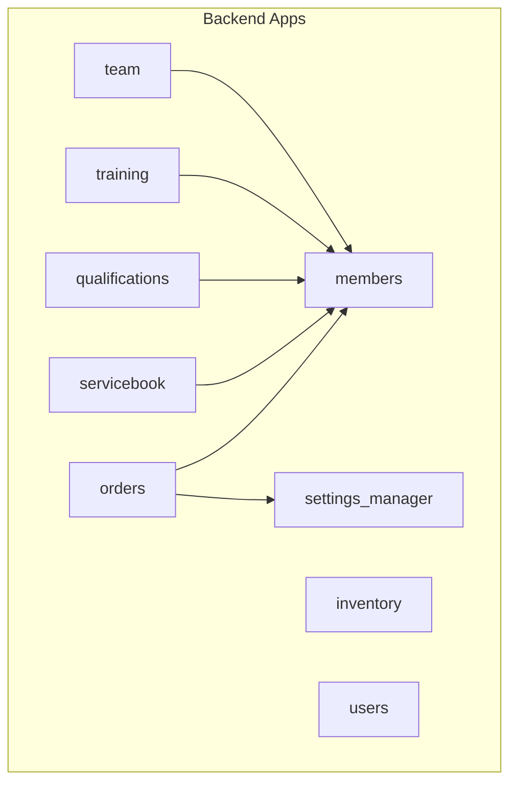
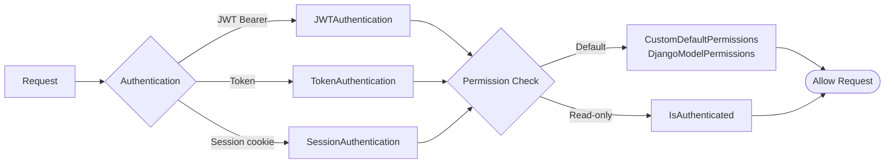
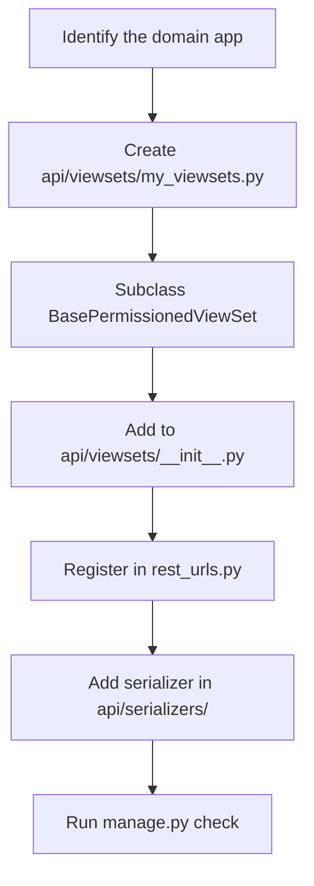

# Backend Architecture

## App Structure

Every Django app follows the same modular layout. The `orders` app is the **reference implementation**.



> **Legacy pattern** (`views.py`, `api_views.py`, `serializers.py` at app root) — still present in some apps, being phased out. Do **not** add new code there.

## App Overview



## URL Registration

All ViewSets are registered in a **single router** at `jf_manager_backend/rest_urls.py`. Individual apps do **not** define their own API URL files.

```
/api/v1/
    users/                          → UserViewSet
    admin/users/                    → AdminUserViewSet
    admin/groups/                   → AuthGroupViewSet
    admin/permissions/              → PermissionViewSet
    admin/department-roles/         → UserDepartmentRoleViewSet

    departments/                    → DepartmentViewSet
    sync-jobs/                      → SyncJobViewSet
    sync-runs/                      → SyncRunViewSet

    members/                        → MemberViewSet
    parents/                        → ParentViewSet
    statuses/                       → StatusViewSet
    groups/                         → GroupViewSet
    member-lists/                   → MemberListViewSet
    events/                         → EventViewSet
    event-types/                    → EventTypeViewSet
    attachments/                    → AttachmentViewSet

    inventory/items/                → ItemViewSet
    inventory/categories/           → CategoryViewSet
    inventory/variants/             → ItemVariantViewSet
    inventory/locations/            → StorageLocationViewSet
    inventory/stocks/               → StockViewSet
    inventory/transactions/         → TransactionViewSet

    servicebook/services/           → ServiceViewSet
    servicebook/attendances/        → AttendanceViewSet

    orders/                         → OrderViewSet
    order-items/                    → OrderItemViewSet
    orderable-items/                → OrderableItemViewSet
    order-statuses/                 → OrderStatusViewSet

    qualifications/types/           → QualificationTypeViewSet
    qualifications/specialtask-types/ → SpecialTaskTypeViewSet
    qualifications/specialtasks/    → SpecialTaskViewSet
    qualifications/                 → QualificationViewSet

    settings/                       → SettingsViewSet
    settings/email-templates/       → EmailTemplateViewSet
    settings/email-layout-templates/→ EmailLayoutTemplateViewSet
    ldap-department-mappings/       → LDAPDepartmentMappingViewSet
    oidc-group-mappings/            → OIDCGroupMappingViewSet

    training/library/categories/    → LibraryBlockCategoryViewSet
    training/library/tags/          → LibraryBlockTagViewSet
    training/library/               → LibraryBlockViewSet
    training/sessions/              → TrainingSessionViewSet
    training/blocks/                → TrainingBlockViewSet
```

## Authentication & Permissions



### Shared Mixins (`jf_manager_backend/mixins.py`)

| Mixin | Authentication | Permission | Filters |
|---|---|---|---|
| `BaseFilterMixin` | — | — | DjangoFilter, Search, Ordering |
| `BaseAuthViewSet` | IsAuthenticated | — | All three |
| `BasePermissionedViewSet` | IsAuthenticated | CustomDefaultPermissions | All three |

Use `BasePermissionedViewSet` for all new endpoints unless the endpoint is intentionally read-only for any authenticated user.

## How to Add a New Endpoint



**Minimal ViewSet template:**

```python
from jf_manager_backend.mixins import BasePermissionedViewSet
from myapp.models import MyModel
from myapp.api.serializers import MyModelSerializer

class MyModelViewSet(BasePermissionedViewSet):
    queryset = MyModel.objects.all()
    serializer_class = MyModelSerializer
```

## Serializer Selection Pattern

When different actions need different amounts of data, use `get_serializer_class()`:

```python
def get_serializer_class(self):
    if self.action == 'list':
        return MyModelListSerializer    # minimal, fast
    elif self.action == 'create':
        return MyModelCreateSerializer  # validation rules
    return MyModelDetailSerializer      # full fields (retrieve, update)
```

## Custom Actions

ViewSet `@action` decorators create extra endpoints automatically:

```python
@action(detail=True, methods=['get'])
def export_excel(self, request, pk=None):
    # Creates: GET /api/v1/members/{id}/export-excel/
    ...

@action(detail=False, methods=['post'])
def send_summary(self, request):
    # Creates: POST /api/v1/orders/send_summary/
    ...
```

## Pagination

All list endpoints return paginated data. The default page size is defined in `settings.py` under `REST_FRAMEWORK.PAGE_SIZE`.

```json
{
  "count": 42,
  "next": "http://localhost:8000/api/v1/members/?page=2",
  "previous": null,
  "results": [...]
}
```

Always use `.results` when consuming lists in the frontend.

## Background Jobs (RQ Worker)

Some backend features use asynchronous jobs (for example external sync runs).

- Queue backend: Redis
- Worker process: `rqworker default`
- Typical deployment: separate worker container/service next to web backend

Flow:

```text
API request -> Django enqueues job in Redis -> worker executes job -> SyncRun/DB status updates
```

If the worker is not running, queued jobs remain pending and sync/status actions will not complete.

## Related Docs

- [API Reference](../api/reference.md)
- [Frontend Structure](frontend-structure.md)
- [Departments And Permissions](departments-and-permissions.md)
