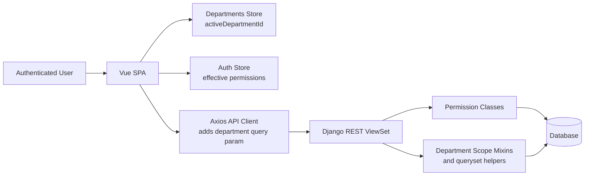
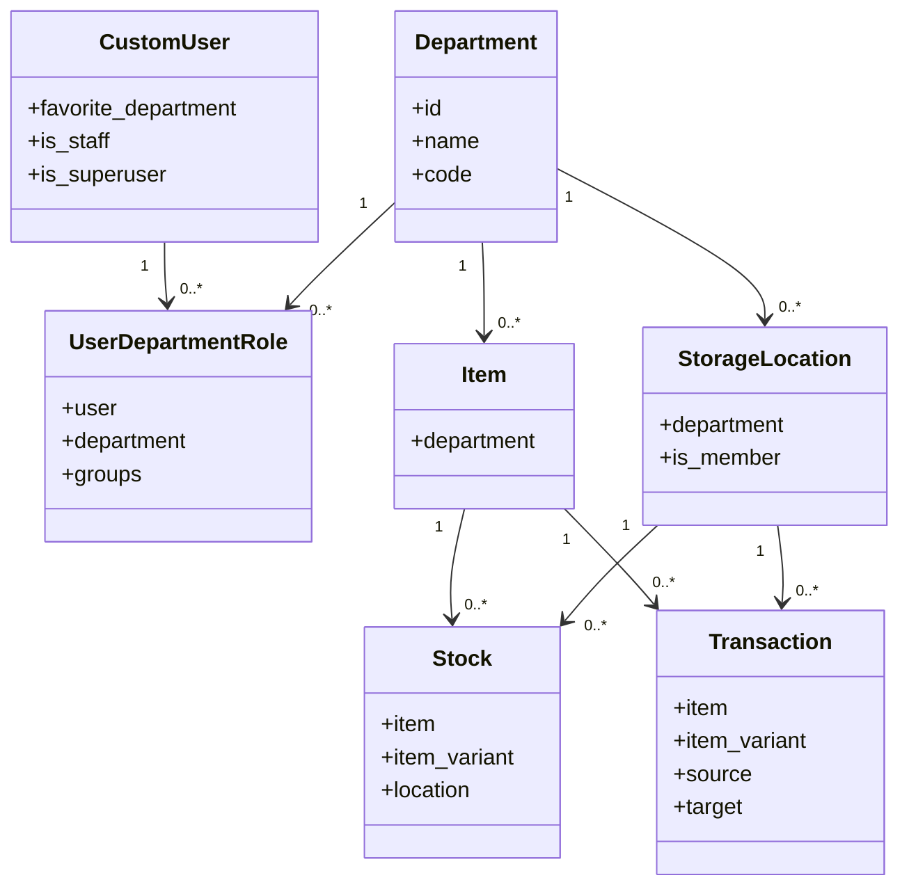
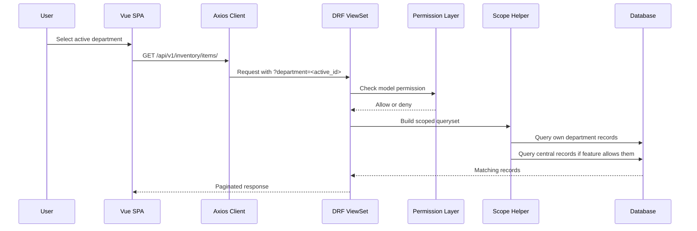

# Departments And Permissions

This document describes the department-scoping and permission model used across the JF-Manager backend and frontend.

It covers:

- department ownership of records
- org-wide vs department-scoped users
- active department switching in the SPA
- backend enforcement for list/detail/write requests
- how central/global records are exposed
- how to extend the system safely

## Goals

The feature exists to support multiple organisational units inside one installation.

Examples:

- one installation serves several youth fire brigade departments
- a central or main organisation maintains shared master data
- local departments can manage only their own operational data
- staff or explicitly org-wide users can work across all departments

The core rule is:

> Visibility may be broader than mutability.

Shared or central records can be visible across departments, while create/update/delete and workflow actions stay restricted to the owning department unless the user has org-wide access.

## Core Concepts

### Department

The backend model [backend/departments/models/department.py](/Users/lukasbisdorf/Dev/JF-Manager/backend/departments/models/department.py) represents a sub-organisation.

Records can reference a department via a nullable `department` foreign key.

- `department=<id>` means the record belongs to that department.
- `department=NULL` means the record is central or shared.

### Department-Scoped User Role

The backend model [backend/departments/models/user_department_role.py](/Users/lukasbisdorf/Dev/JF-Manager/backend/departments/models/user_department_role.py) assigns a user to a department together with one or more Django groups.

Those groups contribute permissions only within that department context.

### Org-Wide User

A user is treated as org-wide when one of these conditions is true:

- `is_staff`
- `is_superuser`
- permission `departments.can_access_all_departments`

Org-wide users can see and manage data across departments.

### Active Department

The frontend persists an `activeDepartmentId` in local storage and attaches it to most GET requests.

This value means:

- which department context the UI is currently showing
- which department-scoped role permissions should be effective in the UI
- which department should be used as default context for some create operations

It does **not** always mean:

- hide all central/shared records

That distinction is important for inventory and shared master data.

## Architecture Overview

## Data Model

## Request Lifecycle

## Backend Building Blocks

### Model Permissions

The backend permission classes live in [backend/jf_manager_backend/permissions.py](/Users/lukasbisdorf/Dev/JF-Manager/backend/jf_manager_backend/permissions.py).

Relevant classes:

- `CustomDefaultPermissions`
  Standard Django model permissions based on HTTP method.
- `DepartmentRoleModelPermissions`
  Extends permission checks so department-role group permissions count in addition to classic Django permissions.
- `OrgWideWritePermission`
  Allows read access for authenticated users but limits write access to org-wide users.

Use `OrgWideWritePermission` for shared master data such as categories or types that should be visible everywhere but editable only centrally.

### Department Queryset Scoping

The base scoping logic lives in [backend/departments/mixins.py](/Users/lukasbisdorf/Dev/JF-Manager/backend/departments/mixins.py).

`DepartmentScopeViewSetMixin` provides:

- validation for `?department=`
- unrestricted access for org-wide users
- per-department filtering for department-scoped users
- optional inclusion of central records via `include_central_records = True`
- default department assignment during creation

Important behavior:

- If `include_central_records = False`, only explicitly owned department records are returned.
- If `include_central_records = True`, records with `department=NULL` stay visible.
- If the frontend sends `?department=<active_id>`, central records still remain visible when `include_central_records = True`.

That last rule exists because the active department is a work context, not a command to hide shared data.

### Inventory Ownership Helpers

Inventory has additional helper logic in [backend/inventory/api/access.py](/Users/lukasbisdorf/Dev/JF-Manager/backend/inventory/api/access.py).

These helpers are needed because not every inventory queryset carries its own `department` field.

Examples:

- `Stock` visibility is derived from the owning item or variant parent item.
- `Transaction` visibility is derived from the transacted item.
- mutating a central inventory record is still restricted to org-wide users.

## Frontend Building Blocks

### Department Store

[frontend/src/stores/departments.ts](/Users/lukasbisdorf/Dev/JF-Manager/frontend/src/stores/departments.ts) manages:

- the list of accessible departments
- the persisted active department
- default initialisation based on `favorite_department`
- the distinction between a concrete department and "all departments"

Default behavior:

- org-wide users default to `All Departments`, unless they have a favourite department
- department-scoped users default to one of their assigned departments

### Auth Store

[frontend/src/stores/auth.ts](/Users/lukasbisdorf/Dev/JF-Manager/frontend/src/stores/auth.ts) computes effective permissions.

Behavior:

- org-wide users always use the full permission set from the backend
- department-scoped users use the role permissions for the currently active department
- UI guards and button states should rely on `hasPerm()` or `canAccessModule()`

### API Client

[frontend/src/api/index.ts](/Users/lukasbisdorf/Dev/JF-Manager/frontend/src/api/index.ts) appends the active department to most GET requests.

This gives the backend enough context to:

- evaluate scoped permissions consistently
- filter department-owned data
- apply default department decisions where needed

Because this parameter is injected broadly, backend endpoints that surface central data must treat it as contextual input rather than as a hard exclusion of `NULL` department records.

## Visibility And Write Rules

### General Rule Set

| Record Type | Department-scoped user can view own dept | Department-scoped user can view central | Department-scoped user can modify own dept | Department-scoped user can modify central | Org-wide user can modify all |
|---|---|---|---|---|---|
| Regular department-owned records | Yes | No, unless feature explicitly allows | Yes, if role grants model permission | No | Yes |
| Shared master data | Depends on endpoint design | Yes | Usually No | No | Yes |
| Central inventory records | Yes, where endpoint allows central visibility | Yes | No | No | Yes |

### Inventory Rules

Inventory is intentionally more nuanced than simple CRUD scoping.

#### Items and Storage Locations

- department-scoped users can see their own department records
- department-scoped users can also see central/shared inventory records
- department-scoped users can edit only records owned by their department
- central inventory records are read-only for department-scoped users

#### Stock and Transactions

- visibility follows the owning item department
- stock for central items remains visible across departments
- transaction creation is allowed only for items owned by the caller's department, unless the caller is org-wide
- source and target locations must fit the owning department rules
- personal member locations may be used as target/source when allowed by the transaction flow

## Route And API Enforcement

The system intentionally enforces permissions in both layers.

### Frontend

The router and module navigation hide inaccessible features.

Purpose:

- reduce confusion
- avoid presenting buttons the user cannot use
- make the current department context explicit

### Backend

The backend remains authoritative.

Purpose:

- block direct URL access
- block handcrafted API calls
- guarantee consistent enforcement for external clients and future UIs

If the frontend and backend disagree, the backend must win.

## How To Add Department Support To A New Endpoint

For a model with a direct `department` field:

1. Add `DepartmentScopeViewSetMixin` to the ViewSet.
2. Set `include_central_records = True` only if central/shared records should remain visible.
3. Use `BasePermissionedViewSet` or the appropriate permission classes.
4. Ensure serializer validation blocks writes to non-owned departments.
5. Add regression tests for:
   - own department visibility
   - central visibility, if applicable
   - foreign department exclusion
   - blocked writes for foreign or central data

For a derived queryset without its own `department` field:

1. Add a queryset helper similar to [backend/inventory/api/access.py](/Users/lukasbisdorf/Dev/JF-Manager/backend/inventory/api/access.py).
2. Derive visibility from the owning entity.
3. Keep create/update validation close to the serializer or domain service.

## Troubleshooting

### Shared records disappear when a department is selected

Likely cause:

- the endpoint receives `?department=<id>` and narrows to that department only

Check:

- does the ViewSet use `DepartmentScopeViewSetMixin`?
- is `include_central_records = True` set?
- does the narrowing step still keep `department=NULL` records?

### User can see a module but API returns `403`

Likely cause:

- frontend UI guards are less strict than backend permission checks

Check:

- `DepartmentRoleModelPermissions`
- effective permissions in [frontend/src/stores/auth.ts](/Users/lukasbisdorf/Dev/JF-Manager/frontend/src/stores/auth.ts)
- route meta and button-level permission guards

### User can edit central data but should not

Likely cause:

- serializer validation or custom permission logic is missing

Check:

- `can_manage_department()` usage
- serializer `validate()` methods
- write endpoints using broad permission classes without ownership validation

## Relevant Files

- [backend/departments/mixins.py](/Users/lukasbisdorf/Dev/JF-Manager/backend/departments/mixins.py)
- [backend/departments/models/department.py](/Users/lukasbisdorf/Dev/JF-Manager/backend/departments/models/department.py)
- [backend/departments/models/user_department_role.py](/Users/lukasbisdorf/Dev/JF-Manager/backend/departments/models/user_department_role.py)
- [backend/jf_manager_backend/permissions.py](/Users/lukasbisdorf/Dev/JF-Manager/backend/jf_manager_backend/permissions.py)
- [backend/inventory/api/access.py](/Users/lukasbisdorf/Dev/JF-Manager/backend/inventory/api/access.py)
- [backend/inventory/api/serializers.py](/Users/lukasbisdorf/Dev/JF-Manager/backend/inventory/api/serializers.py)
- [frontend/src/api/index.ts](/Users/lukasbisdorf/Dev/JF-Manager/frontend/src/api/index.ts)
- [frontend/src/stores/auth.ts](/Users/lukasbisdorf/Dev/JF-Manager/frontend/src/stores/auth.ts)
- [frontend/src/stores/departments.ts](/Users/lukasbisdorf/Dev/JF-Manager/frontend/src/stores/departments.ts)
