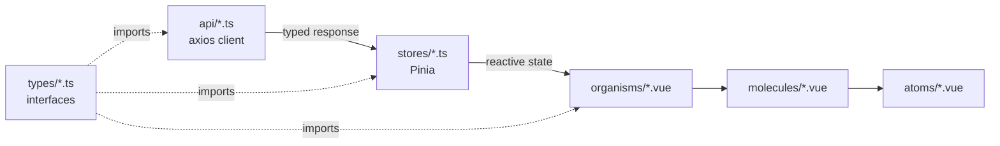
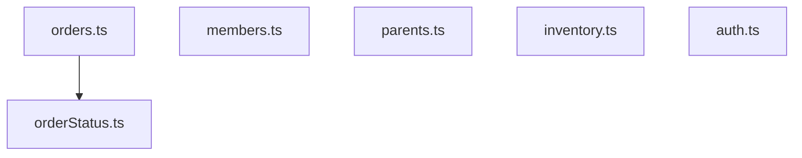
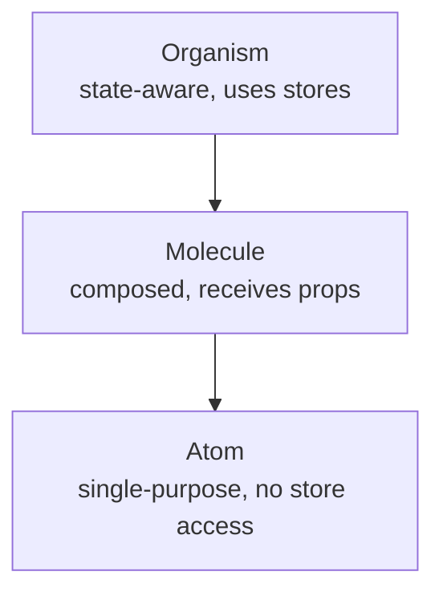
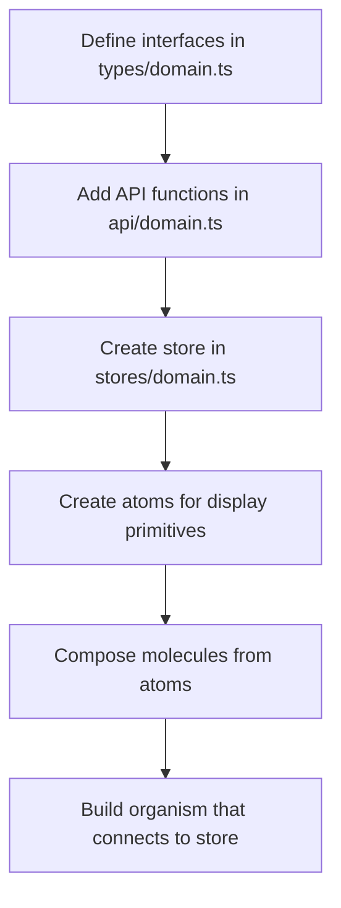

# Frontend Architecture

## Directory Structure

```mermaid
flowchart TD
  root[frontend/src]
  root --> api[api<br/>HTTP client functions axios-based]
  root --> types[types<br/>TypeScript interfaces domain-specific files]
  root --> stores[stores<br/>Pinia state management Composition API]
  root --> components[components]
  components --> domain[{domain}]
  domain --> atoms[atoms<br/>Single-purpose stateless presentational components]
  domain --> molecules[molecules<br/>Composed multi-atom components]
  domain --> organisms[organisms<br/>Complex state-aware components using stores]
```

## Data Flow



## Layers

### `api/` — HTTP Client

One file per domain (e.g. `api/orders.ts`). All functions use the shared `apiClient` instance from `api/index.ts`, which handles JWT auth and token refresh automatically.

```typescript
// api/orders.ts
import apiClient from './index'
import type { Order, PaginatedResponse } from '@/types/orders'

export const ordersApi = {
  list(params?: OrderListParams) {
    return apiClient.get<PaginatedResponse<Order>>('/orders/', { params })
  },
  get(id: number) {
    return apiClient.get<Order>(`/orders/${id}/`)
  }
}
```

**Never** use raw `fetch()` or `axios` directly in components or stores — always go through an `api/` function.

### `types/` — TypeScript Interfaces

Domain-specific files. Add new types to the relevant domain file:

| File | Contents |
|---|---|
| `types/orders.ts` | Order, OrderItem, OrderStatus, OrderCreate … |
| `types/members.ts` | Member, MemberCreate, Status, Group |
| `types/parents.ts` | Parent, ParentCreate |
| `types/events.ts` | Event, EventCreate, EventType |
| `types/common.ts` | PaginatedResponse, UserInfo, AppSettings, auth types |
| `types/api.ts` | ⚠️ Deprecated re-export shim — import from domain files instead |

### `stores/` — Pinia State (Composition API)

All business logic lives here. Components must **never** mutate store state directly — call store actions.

```typescript
// Pattern for every store
export const useOrdersStore = defineStore('orders', () => {
  const items = ref<Order[]>([])
  const loading = ref(false)

  async function fetchOrders(params?: OrderListParams) {
    loading.value = true
    try {
      const response = await ordersApi.list(params)
      items.value = response.data.results  // ← always extract .results
    } finally {
      loading.value = false
    }
  }

  return { items, loading, fetchOrders }
})
```

Key stores:



### `components/` — Atomic Design



| Level | Examples | Store access? |
|---|---|---|
| Atom | `OrderStatusBadge`, `MemberAvatar` | ❌ Never |
| Molecule | `OrderCard`, `MemberListItem` | ❌ Never |
| Organism | `OrdersList`, `OrderDetailView` | ✅ Yes |

## Pagination Pattern

All `api/*.ts` list methods return `PaginatedResponse<T>`. Always extract `.results`:

```typescript
// ✅ Correct
items.value = response.data.results

// ❌ Wrong — sets items to { count, next, previous, results }
items.value = response.data
```

## Component Props/Emits Template

```vue
<script setup lang="ts">
interface Props {
  itemId?: number
}
const props = defineProps<Props>()

const emit = defineEmits<{
  success: [id: number]
  error: [error: unknown]
}>()
</script>
```

## How to Add a New Feature



## Related Docs

- [Backend Structure](backend-structure.md)
- [Vue.js Integration](vue-integration.md)
- [API Reference](../api/reference.md)
- [Members, Lists, Group Editor, Excel Export](../domains/members-lists-groups-exports.md)
- [Settings, LDAP, SSO](../domains/settings-ldap-sso.md)
