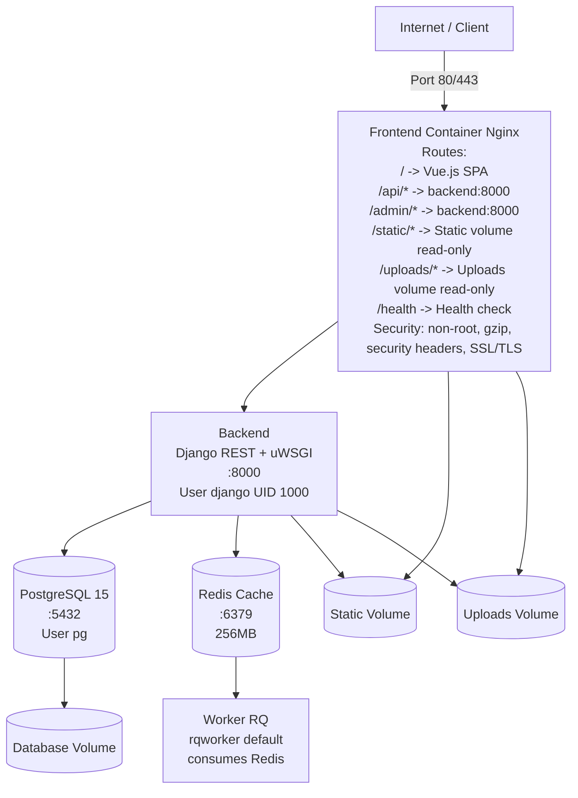
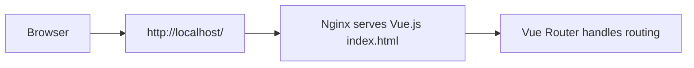
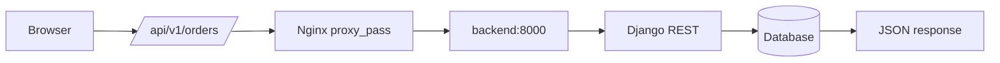
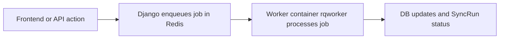
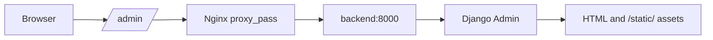
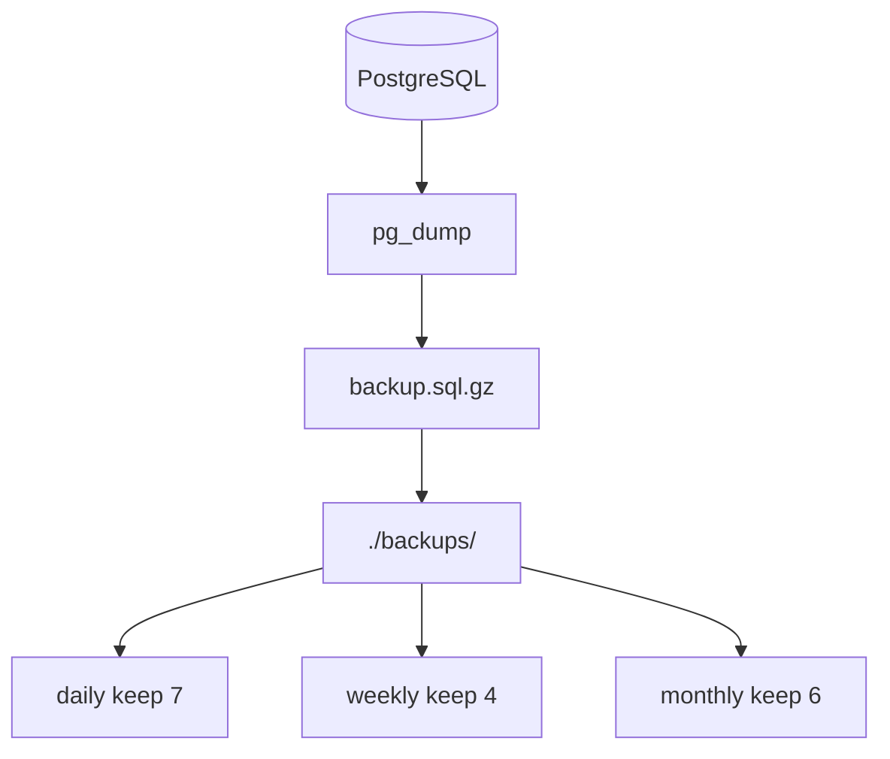

# Architecture Overview

## Docker Architecture

## Request Flow

### SPA Request

### API Request

### Background Job Request

### Admin Request

## Security Layers

1. **Firewall**: Ports 80, 443 only
2. **Nginx**: SSL/TLS, security headers (X-Frame-Options, X-Content-Type-Options, X-XSS-Protection, Referrer-Policy)
3. **Django**: CSRF, ALLOWED_HOSTS, CORS, JWT Authentication
4. **Containers**: Non-root users, read-only filesystems, no new privileges, network segmentation, resource limits

## Build Process

### Backend (Multi-Stage)

| Stage | Base | Purpose | Output |
|-------|------|---------|--------|
| Builder | `python:3.11-slim-bookworm` | Install dependencies via pipenv | Python packages |
| Production | `python:3.11-slim-bookworm` | Copy packages + app code, non-root user | ~350MB image |

### Frontend (Multi-Stage)

| Stage | Base | Purpose | Output |
|-------|------|---------|--------|
| Builder | `node:22-alpine` | `npm ci` + `npm run build` | `/app/dist/` |
| Production | `nginx:1.27-alpine` | Copy built SPA + nginx config | ~50MB image |

## Build And Release Pipeline

The project uses GitHub Actions workflows in `.github/workflows/`:

- `ci.yml`
        - backend tests + coverage
        - backend lint
        - frontend type-check + lint + unit tests + build check
- `build-push.yml`
        - builds backend/frontend Docker images
        - pushes to GHCR (`ghcr.io/.../backend`, `ghcr.io/.../frontend`)
        - runs Trivy image scans and uploads SARIF
- `deploy.yml`
        - manual deployment workflow (`workflow_dispatch`)
        - pulls selected image tag, runs backup/migrate/collectstatic/health checks

For details, see [Build Pipeline](../development/build-pipeline.md).

## Data Persistence

| Volume | Content | Persistence |
|--------|---------|-------------|
| `database` | PostgreSQL data | Persistent |
| `redis` | Redis cache data | Persistent |
| `static` | Django static files | Persistent |
| `uploads` | User uploaded files | Persistent |
| `./backups` | DB backups (bind mount) | Host directory |
| `./nginx/ssl` | SSL certificates (bind mount) | Host directory |

## Backup Strategy

Daily automated backup at 2 AM:

## Resource Allocation

| Service | RAM Limit | RAM (idle) |
|---------|-----------|------------|
| Backend | 2GB | ~200MB |
| Database | 1GB | ~50MB |
| Frontend | 512MB | ~10MB |
| Redis | 256MB | ~5MB |
| Worker (optional) | 512MB | ~50-150MB |
| **Total** | – | **~300MB** |

Recommended minimum: 4GB RAM, 20GB disk.

## Monitoring

| Service | Health Check | Interval |
|---------|-------------|----------|
| Frontend | `wget /health` | 30s |
| Backend | `curl /api/v1/` | 30s |
| Database | `pg_isready` | 30s |
| Redis | `redis-cli ping` | 30s |
| Worker | Queue heartbeat/log monitoring | app-level |

Automatic restart on failure, 3 retries before unhealthy.

Logging: JSON format, 10MB max per file, 3 files rotation.

## Related Architecture Docs

- [Backend Structure](backend-structure.md)
- [Frontend Structure](frontend-structure.md)
- [Departments And Permissions](departments-and-permissions.md)
- [Vue.js Integration](vue-integration.md)
- [Training Module Architecture](training-module.md)
- [Build Pipeline](../development/build-pipeline.md)
