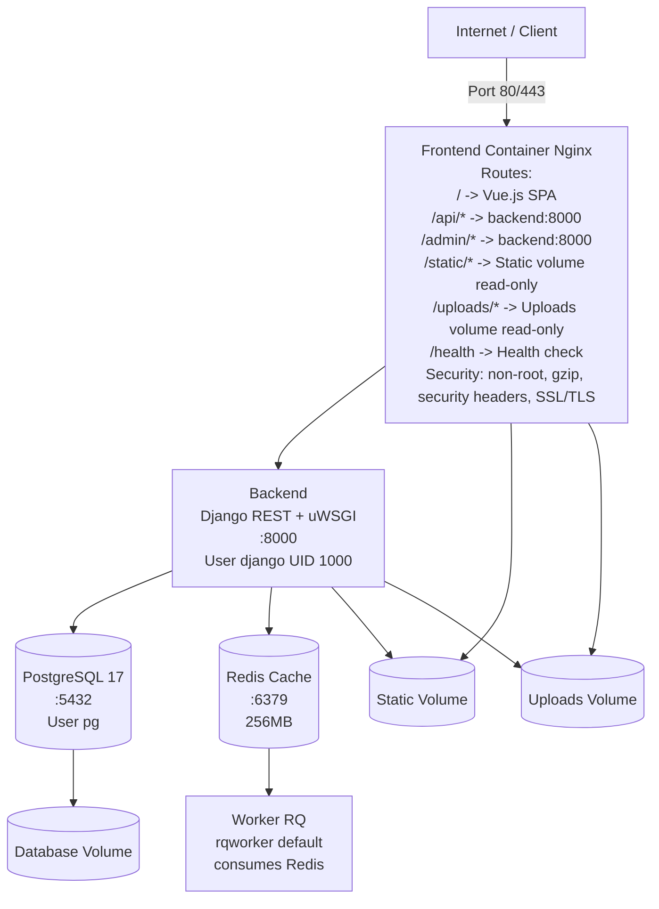
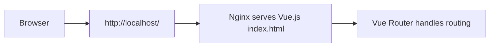
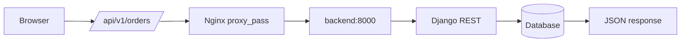
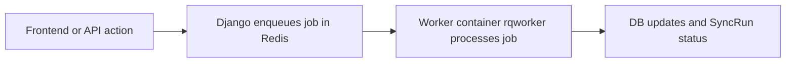
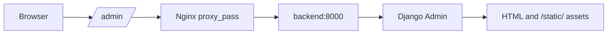

# Architecture Overview

## Docker Architecture

```mermaid
flowchart TD
        client[Internet / Client]
        nginx[Frontend Container Nginx\nRoutes:\n/ -> Vue.js SPA\n/api/* -> backend:8000\n/admin/* -> backend:8000\n/static/* -> Static volume read-only\n/uploads/* -> Uploads volume read-only\n/health -> Health check\nSecurity: non-root, gzip, security headers, SSL/TLS]
        backend[Backend\nDjango REST + uWSGI\n:8000\nUser django UID 1000]
        db[(PostgreSQL 17\n:5432\nUser pg)]
        redis[(Redis Cache\n:6379\n256MB)]
        worker[Worker RQ\nrqworker default\nconsumes Redis]
        staticVol[(Static Volume)]
        uploadsVol[(Uploads Volume)]
        dbVol[(Database Volume)]

        client -->|Port 80/443| nginx
        nginx --> backend
        nginx --> staticVol
        nginx --> uploadsVol
        backend --> db
        backend --> redis
        backend --> staticVol
        backend --> uploadsVol
        db --> dbVol
        redis --> worker
```

## Request Flow

### SPA Request

```mermaid
flowchart LR
        browser[Browser] --> url[http://localhost/]
        url --> nginx[Nginx serves Vue.js index.html]
        nginx --> router[Vue Router handles routing]
```

### API Request

```mermaid
flowchart LR
        browser[Browser] --> api[/api/v1/orders/]
        api --> nginx[Nginx proxy_pass]
        nginx --> backend[backend:8000]
        backend --> drf[Django REST]
        drf --> db[(Database)]
        db --> response[JSON response]
```

### Background Job Request

```mermaid
flowchart LR
        action[Frontend or API action] --> enqueue[Django enqueues job in Redis]
        enqueue --> worker[Worker container rqworker processes job]
        worker --> result[DB updates and SyncRun status]
```

### Admin Request

```mermaid
flowchart LR
        browser[Browser] --> admin[/admin/]
        admin --> nginx[Nginx proxy_pass]
        nginx --> backend[backend:8000]
        backend --> django[Django Admin]
        django --> html[HTML and /static/ assets]
```

## Security Layers

1. **Firewall**: Ports 80, 443 only
2. **Nginx**: SSL/TLS, security headers (X-Frame-Options, X-Content-Type-Options, X-XSS-Protection, Referrer-Policy)
3. **Django**: CSRF, ALLOWED_HOSTS, CORS, JWT Authentication
4. **Containers**: Non-root users, read-only filesystems, no new privileges, network segmentation, resource limits

## Build Process

### Backend (Multi-Stage)

| Stage | Base | Purpose | Output |
|-------|------|---------|--------|
| Builder | `python:3.11-slim-bookworm` | Install dependencies via pipenv | Python packages |
| Production | `python:3.11-slim-bookworm` | Copy packages + app code, non-root user | ~350MB image |

### Frontend (Multi-Stage)

| Stage | Base | Purpose | Output |
|-------|------|---------|--------|
| Builder | `node:22-alpine` | `npm ci` + `npm run build` | `/app/dist/` |
| Production | `nginx:1.27-alpine` | Copy built SPA + nginx config | ~50MB image |

## Build And Release Pipeline

The project uses GitHub Actions workflows in `.github/workflows/`:

- `ci.yml`
        - backend tests + coverage
        - backend lint
        - frontend type-check + lint + unit tests + build check
- `build-push.yml`
        - builds backend/frontend Docker images
        - pushes to GHCR (`ghcr.io/.../backend`, `ghcr.io/.../frontend`)
        - runs Trivy image scans and uploads SARIF
- `deploy.yml`
        - manual deployment workflow (`workflow_dispatch`)
        - runs `jfctl update --version X.Y.Z` on the server (verify, backup, migrate, check, rollback)

For details, see [Build Pipeline](../development/build-pipeline.md).

## Operation

Volumes, backups (Restic, systemd timer), resource limits, health checks and updates are defined by the operations tooling, not by this overview. Single source: [Betrieb: Überblick und Layout](../operations/ops-overview.md) and [jfctl](../operations/ops-jfctl.md).

## Related Architecture Docs

- [Backend Structure](backend-structure.md)
- [Frontend Structure](frontend-structure.md)
- [Departments And Permissions](departments-and-permissions.md)
- [Vue.js Integration](vue-integration.md)
- [Training Module Architecture](training-module.md)
- [Build Pipeline](../development/build-pipeline.md)
