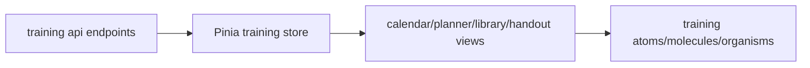

# Training Module Architecture

## Scope

The training module covers:

- calendar and session planning
- reusable library blocks
- session blocks in timeline/swimlane form
- mobile planner and printable handout view
- optional linkage to servicebook entries

## Backend Architecture

Training backend app: `backend/training/`

Structure:

- `models/`
  - `training_session.py`
  - `training_block.py`
  - `library_block.py`
  - `training_media.py`
- `api/viewsets/`
  - `session.py` (`TrainingSessionViewSet`)
  - `block.py` (`TrainingBlockViewSet`)
  - `library.py` (`LibraryBlockViewSet`, category/tag viewsets)
- `api/filters.py`
- `api/permissions.py`

## Core Domain Objects

- TrainingSession
  - date/time, location, notes, recurrence rule
  - many-to-many groups
  - optional parent/children series relation
  - optional servicebook linkage
- TrainingBlock
  - belongs to a session
  - timeline placement (`start_offset_minutes`, `position_order`)
  - optional link to a library block template
- LibraryBlock
  - reusable lesson building blocks
  - category/tag metadata and optional federation export UUID
- TrainingMedia
  - generic media storage for blocks/library blocks

## API Surface

Base routes under `/api/v1/training/`:

- sessions
  - `GET/POST /sessions/`
  - `GET/PATCH/DELETE /sessions/{id}/`
  - `GET /sessions/{id}/handout/`
  - `POST /sessions/{id}/generate_series/`
- blocks
  - `GET/POST /blocks/`
  - `GET/PATCH/DELETE /blocks/{id}/`
  - `PATCH /blocks/{id}/move/`
  - `POST /blocks/{id}/upload_image/`
  - `GET/DELETE /blocks/{id}/media/`
  - `GET/POST/DELETE /blocks/{id}/attachments/`
- library
  - `GET/POST /library/`
  - `GET/PATCH/DELETE /library/{id}/`
  - `GET /library/{id}/usages/`
  - `POST /library/{id}/upload_image/`
  - `GET/DELETE /library/{id}/media/`
  - `GET/POST/DELETE /library/{id}/attachments/`
  - `POST /library/export_blocks/`
  - `POST /library/import_blocks/`
- taxonomy
  - `GET/POST/PATCH/DELETE /library/categories/`
  - `GET/POST/DELETE /library/tags/`

## Permission Model

Defined in `training/api/permissions.py`:

- `CanManageTraining`
  - read: authenticated users
  - write: `training.can_manage_training`
- `CanManageLibrary`
  - read: authenticated users
  - write: `training.can_manage_library`

Department and org-wide constraints are applied through broader project permission and scope patterns.

## Frontend Architecture

Primary frontend locations:

- views
  - `frontend/src/views/training/TrainingCalendarView.vue`
  - `frontend/src/views/training/TrainingPlannerView.vue`
  - `frontend/src/views/training/TrainingMobilePlannerView.vue`
  - `frontend/src/views/training/TrainingHandoutView.vue`
  - `frontend/src/views/training/LibraryView.vue`
- store
  - `frontend/src/stores/training.ts`
- api client
  - `frontend/src/api/training.ts`
- types
  - `frontend/src/types/training.ts`
- components
  - `frontend/src/components/training/{atoms,molecules,organisms}`

## Data Flow

## Integration Points

- Departments: sessions can be department-bound.
- Servicebook: session create/update/delete keeps linked servicebook entries in sync.
- Attachments/media: generic upload pipeline reused for block and library content.

## Related Docs

- `docs/domains/training-module.md`
- `docs/architecture/departments-and-permissions.md`
- `docs/api/reference.md`
