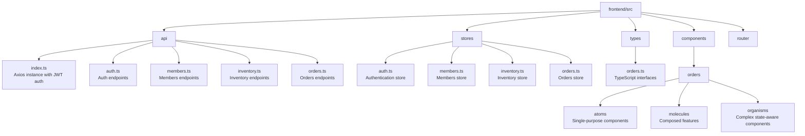

# Vue.js + Pinia Integration Guide

Patterns for integrating the JF-Manager REST API with the Vue 3 + Pinia frontend.

## Project Structure



## API Client

The base API client (`api/index.ts`) handles JWT auth, token refresh, and CORS automatically:

```typescript
import axios from 'axios'
import { useAuthStore } from '@/stores/auth'

const apiClient = axios.create({
  baseURL: import.meta.env.VITE_API_BASE_URL || 'http://localhost:8000/api/v1',
  headers: { 'Content-Type': 'application/json' },
})

// Request interceptor: attach Bearer token
apiClient.interceptors.request.use((config) => {
  const authStore = useAuthStore()
  if (authStore.accessToken) {
    config.headers.Authorization = `Bearer ${authStore.accessToken}`
  }
  return config
})

// Response interceptor: auto-refresh on 401
apiClient.interceptors.response.use(
  (response) => response,
  async (error) => {
    if (error.response?.status === 401 && !error.config._retry) {
      error.config._retry = true
      const authStore = useAuthStore()
      await authStore.refreshAccessToken()
      error.config.headers.Authorization = `Bearer ${authStore.accessToken}`
      return apiClient(error.config)
    }
    return Promise.reject(error)
  }
)
```

## API Endpoint Pattern

```typescript
import apiClient from './index'
import type { Order, PaginatedResponse } from '@/types/orders'

export const ordersApi = {
  list(params?: OrderListParams) {
    return apiClient.get<PaginatedResponse<Order>>('/orders/', { params })
  },
  get(id: number) {
    return apiClient.get<Order>(`/orders/${id}/`)
  },
  create(data: OrderCreate) {
    return apiClient.post<Order>('/orders/', data)
  },
}
```

## Pinia Store Pattern (Composition API)

All stores use `defineStore(() => {})` (Composition API):

```typescript
import { ref, computed } from 'vue'
import { defineStore } from 'pinia'
import { ordersApi } from '@/api/orders'
import type { Order } from '@/types/orders'

export const useOrdersStore = defineStore('orders', () => {
  const orders = ref<Order[]>([])
  const loading = ref(false)

  const hasOrders = computed(() => orders.value.length > 0)

  async function fetchOrders(params?: OrderListParams) {
    loading.value = true
    try {
      const response = await ordersApi.list(params)
      orders.value = response.data.results  // ← Extract .results!
      return orders.value
    } finally {
      loading.value = false
    }
  }

  return { orders, loading, hasOrders, fetchOrders }
})
```

**Key rules:**
- Components are **presentation-only** – all business logic in stores
- **Never** mutate store state from components – call store actions
- Always extract `.results` from paginated responses

## Component Patterns

### Props/Emits

```vue
<script setup lang="ts">
interface Props {
  orderId?: number
  initialData?: Order
}
const props = defineProps<Props>()

const emit = defineEmits<{
  success: [orderId: number]
  error: [error: unknown]
}>()
</script>
```

### Using Store Data

```vue
<script setup lang="ts">
import { computed, onMounted } from 'vue'
import { useOrdersStore } from '@/stores/orders'

const ordersStore = useOrdersStore()
const orders = computed(() => ordersStore.orders)

onMounted(() => ordersStore.fetchOrders())
</script>
```

## Pagination Type

```typescript
interface PaginatedResponse<T> {
  count: number
  next: string | null
  previous: string | null
  results: T[]
}
```

## Router Guards

```typescript
router.beforeEach((to) => {
  const authStore = useAuthStore()
  if (to.meta.requiresAuth && !authStore.isAuthenticated) {
    return { name: 'login' }
  }
})
```

## Reference Implementation

See `backend/orders/api/` + `frontend/src/components/orders/` for the complete pattern.
