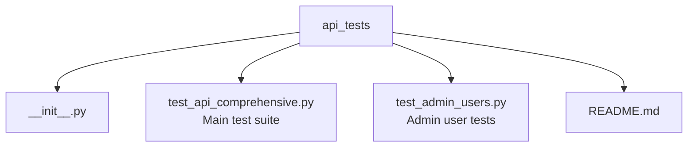

# API Testing Guide

## Overview

Tests in `backend/api_tests/` cover authentication, permissions, serialization, CRUD operations, filtering, and custom ViewSet actions.

## Running Tests

```bash
# All API tests
python manage.py test api_tests

# With verbose output
python manage.py test api_tests --verbosity=2

# Specific test class
python manage.py test api_tests.test_api_comprehensive.AuthenticationTests
python manage.py test api_tests.test_api_comprehensive.PermissionsTests
python manage.py test api_tests.test_api_comprehensive.UserAPITests
python manage.py test api_tests.test_api_comprehensive.CRUDOperationsTests

# With coverage
pip install coverage
coverage run --source='.' manage.py test api_tests
coverage report
coverage html
```

## Test Structure



### Test Classes

| Class | Tests |
|-------|-------|
| `BaseAPITestCase` | Base class with setup (test users, auth helpers, permission utilities) |
| `AuthenticationTests` | JWT, session auth, invalid tokens, unauthenticated access |
| `UserAPITests` | `/api/v1/users/me/`, password change, user list permissions |
| `PermissionsTests` | View/add/change/delete permissions per model |
| `DataRepresentationTests` | Pagination, filtering, search, related data |
| `CRUDOperationsTests` | Create, list, retrieve, update, delete |
| `CustomActionsTests` | Item stock, item variants, category items |
| `OrdersAPITests` | Order management endpoints |
| `QualificationsAPITests` | Qualification and special task endpoints |
| `ServicebookAPITests` | Servicebook and attendance endpoints |
| `MembersAPITests` | Member and parent endpoints |

## Adding New Tests

```python
class MyNewAPITests(BaseAPITestCase):
    def setUp(self):
        super().setUp()
        self.grant_permissions(self.authorized_user, 'modelname', ['view', 'add'])
        self.authenticate_user(self.authorized_user)

    def test_my_endpoint(self):
        response = self.client.get('/api/v1/myendpoint/')
        self.assertEqual(response.status_code, 200)
        self.assertIn('expected_field', response.data)
```

### Always test both allowed and denied:

```python
def test_without_permission_denied(self):
    self.authenticate_user(self.regular_user)
    response = self.client.get('/api/v1/protected/')
    self.assertEqual(response.status_code, 403)

def test_with_permission_allowed(self):
    self.grant_permissions(self.authorized_user, 'model', ['view'])
    self.authenticate_user(self.authorized_user)
    response = self.client.get('/api/v1/protected/')
    self.assertEqual(response.status_code, 200)
```

## Best Practices

- Use descriptive test names: `test_user_cannot_delete_without_delete_permission`
- Test edge cases (pagination last page, special characters in search)
- Clean up after tests
- Use `self.grant_permissions()` helper for permission setup
- Test data validation with invalid inputs (expect 400)
