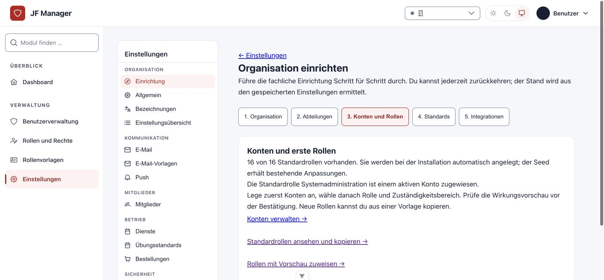
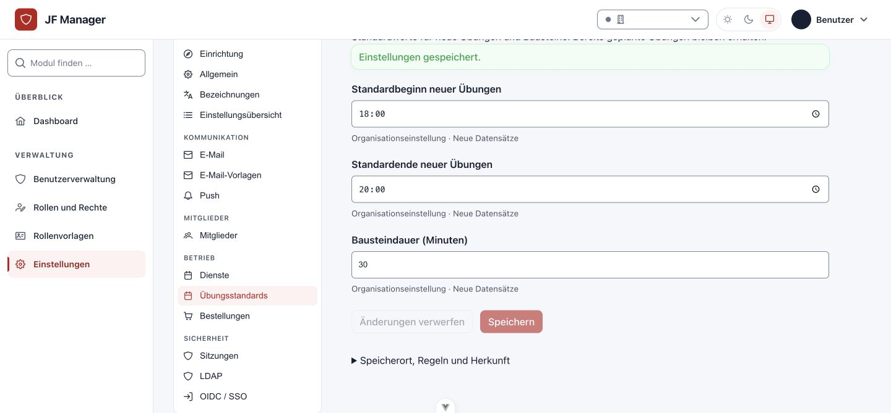
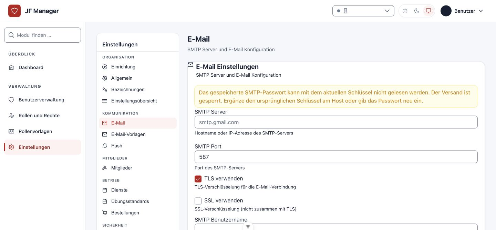

# Einrichtung und Organisationseinstellungen

Unter **Einstellungen → Einrichtung** führt der Assistent durch Organisation, Abteilungen,
Konten/Rollen, Standards und optionale Integrationen. Er liest den tatsächlichen gespeicherten
Stand; das Öffnen des Assistenten verändert keine Rollen oder Daten. Organisationen können
auch ohne Abteilungen arbeiten.

## Organisation und Standards

**Allgemein** verwaltet Anwendungsname, Organisationsbezeichnung, öffentliches Logo und Farbe.
**Bezeichnungen** passt die drei Modulnamen für Mitglieder, Dienstbuch und Ausbildungsplanung
in der Navigation an. Änderungen an Bezeichnungen ändern keine Daten oder Berechtigungen.

**Anmeldeseite** ändert die Texte der öffentlichen Anmeldeseite: Kopfzeile, Überschrift,
Einleitung, Fußzeile und den Hinweis unter dem Formular (etwa, wen man um einen Zugang bittet).
Standard sind die bisherigen Texte. Erlaubt ist nur reiner Text (Kopfzeile und Fußzeile höchstens
80 bzw. 120 Zeichen, Überschrift 120, Einleitung 400, Hinweis 300); Zeilenumbrüche bleiben
erhalten, HTML wird als Text angezeigt. Ein leeres Feld blendet den Text aus. Die Änderung gilt
beim nächsten Aufruf der Anmeldeseite; nötig ist dasselbe Recht wie für **Allgemein**.

**Dienste** und **Übungsstandards** verwalten die Start-/Endzeiten neuer Termine;
Übungsstandards zusätzlich die Dauer neuer Bausteine (1–480 Minuten). Vorhandene Termine,
Bausteine, Serien und Vorlagen behalten ihre eigenen Werte. Beginn muss vor Ende liegen.
Ungültige Teiländerungen werden insgesamt abgewiesen; Eingaben bleiben erhalten.

Die übrigen Stammdaten werden aus dem Assistenten in ihren bestehenden Webverwaltungen
geöffnet: Gruppen, Anwesenheitsstatus, Ereignisarten, Qualifikations-/Aufgabenarten,
Übungsvorlagen, Inventar, Bestellartikel und Statusabläufe. Der jeweilige Fachbereich benötigt
weiterhin seine eigenen Rechte. **Rollen und Rechte** bietet eine Wirkungsvorschau;
**Rollenvorlagen** unterstützt Neuerstellung und Kopien. Siehe [Rollenhandbuch](roles-and-permissions.md).

## E-Mail und externe Anmeldung

SMTP, E-Mail-Vorlagen, LDAP, OIDC und externe Mitgliedersynchronisation werden im Web
verwaltet. Änderungen an Anmeldung und Zugangsdaten verlangen eine erneute Bestätigung.
Gespeicherte Passwörter/Geheimnisse werden nie zurückgegeben. Ein leeres unverändertes
Passwortfeld erhält den alten Wert; beim SMTP-Passwort gibt es einen eigenen Schalter zur
**ausdrücklichen Entfernung**.

Speichere SMTP-Änderungen vor einem Test. **Verbindung testen** prüft die Verbindung ohne
Nachricht und ohne fachliche Datenänderungen. **Test-E-Mail senden** verlangt eine gültige
Empfängeradresse und eine ausdrückliche Versandbestätigung. Anbieterfehler werden ohne
Zugangsdaten ausgegeben. Webanfragen, Worker und Managementbefehle verwenden dieselben
DB-gestützten SMTP-Zugangsdaten.

Für die erste lokale Einrichtung oder ein nicht lesbares SMTP-Passwort gilt die begrenzte
[Entwicklungsregel](../getting-started.md#nicht-lesbares-smtp-passwort-in-der-entwicklung).
VS Code startet mit `DEBUG=True` und `DEV_ALLOW_UNREADABLE_SMTP=True` weiter; der Versand
bleibt vollständig gesperrt, das gespeicherte Geheimnis unverändert. Andere verschlüsselte
Daten und der Produktionsstart bleiben strikt. Entweder den passenden alten Schlüssel am
Host ergänzen oder das SMTP-Passwort im Web neu eingeben.

## Sitzungen und Push

**Sitzungen** verwaltet Zeiten ohne Aktivität und maximale Sitzungsdauern für normale und
privilegierte Konten. Die Oberfläche rechnet Minuten, Stunden oder Tage in die verbindlichen
Sekundenwerte um. Die maximal erlaubte Dauer muss mindestens der Inaktivitätsdauer entsprechen.
Neue Werte gelten ab der nächsten Sitzungsprüfung, auch für bestehende Sitzungen.
Hostvorgaben stehen mit Herkunft als gesperrte Felder da und können im Web nicht überschrieben
werden. Die serverseitigen Grenzen stehen in der Einstellungsübersicht.

Unter **Push** zuerst eine Kontaktadresse (`mailto:` oder `https://`) eintragen und
**Versandschlüssel sicher erzeugen** wählen. Der private Schlüssel wird verschlüsselt gespeichert
und nicht angezeigt. Push bleibt zunächst aus; danach ausdrücklich aktivieren. Geräte melden
sich separat im persönlichen Profil für Push an. Ein Test in diesem Paket sendet keine reale
Push-Nachricht.

Vorhandene Schlüssel werden nicht automatisch ersetzt. Manuelle Paare werden auf EC-P256
und Zusammengehörigkeit geprüft. Zum erneuten Erzeugen zuerst die vorhandenen Schlüssel
mit ausdrücklicher Bestätigung entfernen; dabei wird Push ausgeschaltet. Danach müssen sich
alle Geräte erneut anmelden. Host-VAPID-Schlüssel bleiben gesperrt, die Push-Aktivierung kann
weiterhin im Web ausgeschaltet werden.

## Quellen, Grenzen und Betrieb

**Einstellungsübersicht** zeigt pro Feld Speicherung, Herkunft, Regeln und Wirksamkeit. Die
Ansicht enthält nur erlaubte Kategorien und keine Geheimniswerte. Fachliche Konfiguration
liegt in der Datenbank; zulässige Hostüberschreibungen sind erkennbar. Der vollständige
[Feldkatalog](../planning/configuration-catalog.md) dokumentiert die technischen Schnittstellen.

Installation, Domain/Ports, Proxy/TLS, Datenbank/Redis, Hauptschlüssel, Speicherpfade,
Backups und Wiederherstellung bleiben Hostaufgaben. Für normale fachliche Verwaltung ist
kein Django-Admin nötig.

Bei Updates zuerst Migrationen mit dem zur Datenbank passenden Schlüsselring ausführen.
Die SMTP-Migration verschlüsselt vorhandene Klartext-Preferences; sie stellt keine
rückwärts entschlüsselnde Migration bereit. Backup und Restore müssen Datenbank, Schlüsselring
und passende Anwendungsversion zusammen erhalten. `rotate_field_encryption` prüft alle
Geheimnisfelder; `--apply` schreibt sie nach erfolgreicher Gesamtprüfung atomar mit dem
Primärschlüssel neu. Ein neuer Schlüssel ohne alten Schlüssel kann bestehende Daten nicht
wiederherstellen.
