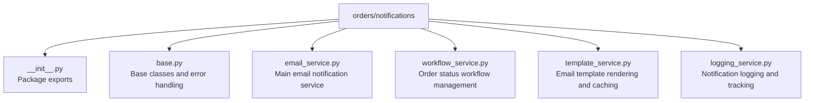

# Order Notification System

## Overview

The notification system provides modular email notification functionality for order management, with separated concerns for business logic, template rendering, logging, and email sending.

## Module Structure



## Core Components

### Email Service (`email_service.py`)

Main service for sending order-related email notifications.

**Notification types:**
- Order creation notifications
- Status update notifications
- Bulk status update notifications
- Pending order reminders
- Order summary notifications

```python
from orders.notifications import OrderNotificationService

OrderNotificationService.send_order_created_notification(order, request)
OrderNotificationService.send_status_update_notification(order_item, old_status, new_status, updated_by, request)
```

### Workflow Service (`workflow_service.py`)

Manages order status transitions. **Never** change order status without validation via this service.

```python
from orders.notifications import OrderWorkflowService

# Get allowed next statuses
transitions = OrderWorkflowService.get_available_transitions(current_status)

# Validate a transition
is_valid = OrderWorkflowService.validate_status_change(old_status, new_status)

# Validate bulk transition
validation = OrderWorkflowService.validate_bulk_transition(order_items, target_status)
```

**Status categories:**
- `active`: pending, ordered, received, ready
- `completed`: delivered
- `terminated`: cancelled, defective
- `actionable`: pending, ordered, defective
- `final`: delivered, cancelled

### Template Service (`template_service.py`)

Handles email template rendering with caching. Supports custom templates from database with fallback to default file templates.

**Template types:** `order_created`, `status_update`, `bulk_update`, `pending_reminder`, `order_summary`

```python
from orders.notifications import TemplateRenderer

subject, html, plain = TemplateRenderer.render_email_content('order_created', context)
```

### Logging Service (`logging_service.py`)

Tracks notification delivery status (pending → sent/failed), error logging, notification history and statistics, audit trail.

```python
from orders.notifications import NotificationLogger

stats = NotificationLogger.get_notification_stats(days=30)
```

## Configuration

```python
# Django settings
DEFAULT_FROM_EMAIL = 'noreply@jf-manager.example.com'
DEFAULT_DOMAIN = 'localhost:8000'
DEFAULT_PROTOCOL = 'http'

# Redis cache for template caching
CACHES = {
    'default': {
        'BACKEND': 'django.core.cache.backends.redis.RedisCache',
        'LOCATION': 'redis://127.0.0.1:6379/1',
    }
}
```

Users can control notifications via `NotificationPreferences` (email_new_orders, email_status_updates, email_bulk_updates).

## Architecture Principles

- **Single Responsibility**: Each module handles one aspect
- **Separation of Concerns**: Business logic, templates, logging, and email sending are separate
- **Error Handling**: Comprehensive error handling and logging throughout
- **Testability**: Modular design for easy unit testing
- **Extensibility**: Easy to add new notification types
