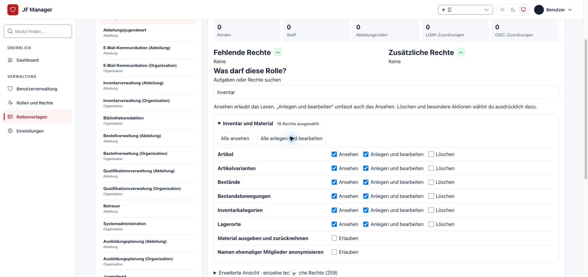
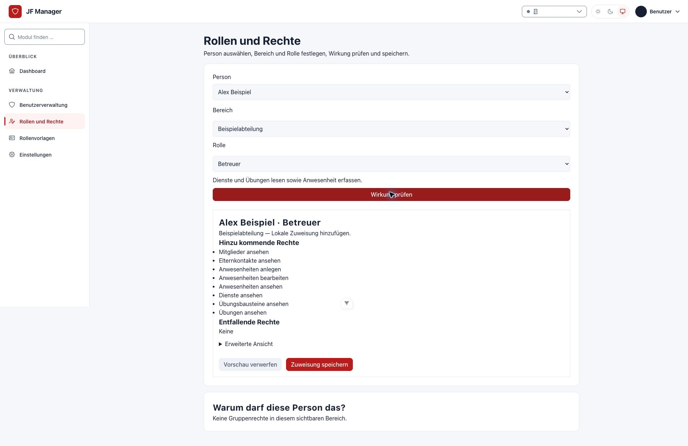

# Rollen und Berechtigungen

Stand: 06.10.2026. Die [Rollenübersicht](../planning/role-permission-manifest.md) erklärt alle 16 ausgelieferten Vorlagen. Rollen addieren sich innerhalb des zugewiesenen Bereichs. Systemadministration verwaltet Konten, Integrationen und Konfiguration; fachlichen Zugriff erhält sie durch zusätzliche Rollen. Staff allein ist kein Fachrecht.

## Einer Person eine Rolle geben

1. Mit einem berechtigten Konto **Rollen** öffnen (`/roles`). Administrierende und delegierende Leitungen benötigen Mehrfaktor-Anmeldung. Falls die Bestätigung abgelaufen ist, fordert die Anwendung vor einer geschützten Aktion eine erneute Bestätigung an.
2. **Person** auswählen. Das eigene Konto steht nicht zur Auswahl. Delegierende können privilegierte Konten nicht bearbeiten.
3. **Bereich** auswählen: eine erlaubte Abteilung oder, ausschließlich administrativ, die Organisation.
4. **Rolle** auswählen. Die Liste enthält nur Rollen, die in diesem Bereich zugewiesen werden dürfen.
5. **Wirkung prüfen** wählen. Person, Bereich, Beschreibung und hinzukommende Rechte kontrollieren. Lesbare Bezeichnungen sind die Standardansicht; technische Namen stehen unter **Erweiterte Ansicht**.
6. Die geprüfte Zuweisung bestätigen. Erst diese Aktion speichert. Wurde zwischenzeitlich ein Recht oder eine Zuweisung geändert, wird nichts gespeichert: die Wirkung erneut prüfen. Eingaben bleiben bei Fehlern erhalten.

Unter **Warum darf diese Person das?** zeigt die Anwendung Rollen, Bereiche, Rechte und Herkunft. Alle angemeldeten Personen können ihre eigenen Rechte ansehen. Leitungen sehen fremde Rollen ausschließlich in ihren erlaubten Abteilungen; die Systemadministration kann die vollständige Zuordnung prüfen.

## Delegation freigeben

In **Rollenvorlagen** (`/role-templates`) prüft die Systemadministration Beschreibung, Bereich und tatsächliche Berechtigungen. Die Option **Abteilungsleitungen dürfen diese Rolle nach Freigabe zuweisen** bedeutet: Berechtigte Leitungen können diese Rolle an andere Personen ihrer Abteilung vergeben, ohne deren Rechte verändern zu dürfen. Das Aktivieren der Option allein erteilt noch keine Freigabe. Eine dafür vorgesehene Abteilungsrolle benötigt eine ausdrückliche **Für Abteilungsleitungen freigeben**-Aktion. Die Freigabe gilt für genau die aktuelle Gruppe, ihren Bereich und ihre Rechte. Änderungen, auch über die technische Gruppenverwaltung, machen die Freigabe unwirksam. Organisations-, administrative und anonymisierende beziehungsweise löschende Rollen werden nicht als untergeordnete Fachrolle freigegeben.

Der Jugendwart kann Abteilungsjugendwarte und freigegebene untergeordnete Rollen zuweisen. Der Abteilungsjugendwart kann freigegebene Fachrollen seiner Abteilung zuweisen. Organisationsrollen einschließlich Jugendwart und Systemadministration vergibt ausschließlich die Systemadministration. Jugendleiter und Betreuer besitzen selbst kein Delegationsrecht.

## Eine neue Rolle anlegen oder eine Vorlage nutzen

In **Rollenvorlagen** **Neue Rolle** wählen. Anzeigename, Beschreibung und Bereich eintragen, Rechte in den Aufgabenbereichen auswählen. **Alle ansehen** oder **Alle anlegen und bearbeiten** wählt die passenden Rechte eines Bereichs gemeinsam; Löschen und Sonderaktionen bleiben getrennt. Einzelne Aufgaben können weiterhin angepasst werden. Die Suche findet vertraute Begriffe wie Mitglieder oder Bestellungen. Anschließend die Auswahl prüfen und **Rolle anlegen** bestätigen. Für eine Organisationsrolle ergänzt die Anwendung die Organisationssicht; die Fachrechte werden ausdrücklich gewählt. Der technische Schlüssel wird automatisch erzeugt und bleibt unter **Erweiterte Ansicht** optional anpassbar.



*Die Sammelauswahl setzt Lese- und Bearbeitungsrechte. Löschen und Sonderaktionen bleiben getrennt. Das Beispiel zeigt einen ungespeicherten Entwurf mit fiktiven Daten.*

Die neu angelegte Rolle erscheint sofort in der Vorlagenliste. Die Zuweisungszahlen zeigen, dass dadurch noch niemand Rechte erhalten hat.

Für eine Rolle mit ähnlichen Aufgaben die bestehende Vorlage auswählen und **Vorlage kopieren** wählen. Name und Beschreibung anpassen und **Kopie anlegen** bestätigen. Die neue Rolle übernimmt die aktuellen Gruppenrechte und den Bereich, erhält aber keine Personen- oder Abteilungszuweisungen und keine Delegationsfreigabe. Mehrere Kopien können ohne technische Namenskonflikte angelegt werden. Anschließend die Rechte prüfen und bei Bedarf anpassen, danach delegierbare Abteilungsrollen ausdrücklich freigeben.



*Vor der Speicherung zeigt die Wirkungsvorschau Person, Abteilung und hinzukommende Rechte. Die Abbildung verwendet ausschließlich fiktive Daten.*

## Rechte einer bestehenden Rolle ändern

Eine Vorlage auswählen und unter **Was darf diese Rolle?** die Aufgaben anpassen. Anlegen und Bearbeiten ergänzt das Ansehen; beim Abschalten der Bearbeitung bleibt vorhandenes Ansehen erhalten. Teilweise ausgewählte Rechte werden gekennzeichnet. Zusätzliche Rechte bleiben erhalten und können in **Erweiterte Ansicht** einzeln geprüft werden. **Auswahl prüfen und übernehmen** bestätigt die gesamte Auswahl für alle bisherigen Zuweisungen. Technische Gruppennamen stehen unter **Erweiterte Rollendaten**.

## Entfernen und Herkunft verstehen

Die Erklärung kennzeichnet **Lokal**, **LDAP** und **OIDC**. Eine lokale Rolle wird über die angezeigte Entfernung mit Wirkungsvorschau entfernt. Besteht dieselbe Rolle zusätzlich aus einer externen Quelle, zeigt die Vorschau, dass diese wirksam bleibt. Eine externe Rolle wird über das zugehörige Mapping beziehungsweise den Anbieter entzogen; lokales Entfernen überschreibt sie nicht. LDAP- und OIDC-Quellen sind voneinander unabhängig. Mappinglöschung entzieht ihre eigenen Quellen unmittelbar. Bei fehlender Gruppenzugehörigkeit wirkt die konfigurierte Entzugsregel beim nächsten erfolgreichen Login.

Archivieren verhindert neue Zuweisungen und erhält bestehende Rechte. Für einen Entzug deshalb die einzelnen Zuweisungen beziehungsweise externen Mappings bearbeiten. Vorlagen duplizieren erzeugt eine eigenständige, noch nicht freigegebene Rolle. Rechteänderungen einer bereits zugewiesenen Gruppe wirken unmittelbar auf deren Personen; vorher den Soll/Ist-Vergleich und die Zuweisungszahlen prüfen.

## Fachliche Bereiche

| Aufgabe | Passende Rolle und Grenze |
| --- | --- |
| Anwesenheit erfassen | Betreuer; Dienste und veröffentlichte Übungen der eigenen Abteilung lesen, keine Stammdatenbearbeitung. |
| Material ausgeben/rücknehmen | Inventarverwaltung; minimale Personenauswahl, Lagerbewegungen und nachvollziehbare Gegenbuchungen im eigenen Bereich. |
| Bestellung und Wareneingang | Bestellverwaltung; Bestellung, Artikel und Eingangslager werden auf den tatsächlichen Bereich geprüft. Das Eingangsrecht erlaubt keine beliebigen Inventarbuchungen. |
| Zentrale Kleiderkammer | Organisationsvariante Inventarverwaltung; kann Mitglieder aller Abteilungen auswählen. Organisationssicht allein genügt nicht. |
| Übungen planen | Ausbildungsplanung; Entwürfe und Planung im eigenen Bereich. Bibliotheksredaktion verwaltet die gemeinsame Bausteinbibliothek. |
| E-Mail senden | Separate E-Mail-Kommunikation; keine SMTP-/SSO-Konfiguration. |
| Konten und Integrationen verwalten | Systemadministration; Fachmodule zusätzlich zuweisen. |

Beispiel: Jugendleiter in Abteilung A plus Inventarverwaltung in B erlaubt Mitgliederdaten in A und Inventaränderungen in B. Eine zusätzliche Organisationssicht erweitert das Inventarschreibrecht aus B nicht. Zentrale Artikelkataloge sind fachlich lesbar, Änderungen verlangen ein globales Fachrecht.

## Installation und bestehende Gruppen

Vor einem Upgrade eine Sicherung erstellen. Der reguläre Installations- und Releaseablauf führt die Migrationen aus. Danach werden fehlende Standardvorlagen automatisch angelegt, sobald sämtliche Modellpermissions vorhanden sind. Damit greift derselbe Seed bei Docker-Start, Dev-Start und manueller Installation. Ein zusätzlicher manueller Seed ist für die erste Anlage nicht erforderlich; für Prüfung und Wiederholung steht der Command weiterhin zur Verfügung:

```sh
python manage.py migrate
python manage.py seed_role_templates --dry-run
python manage.py seed_role_templates
```

Der Seed erzeugt fehlende Vorlagen idempotent und vergibt keinem Konto eine Rolle. Vorhandene Gruppen werden weder aufgrund gleicher Anzeigenamen übernommen noch stillschweigend erweitert. Bei Katalogupdates zeigt **Rollenvorlagen** den Vergleich; eine Änderung wird dort ausdrücklich bestätigt. Die neuen Versionen ergänzen Delegation, administrative Zuweisung, Inventarkategorien/Gegenbuchung und Bestell-Wareneingang. Bestehende Installationen erhalten diese Rechte erst nach ausdrücklicher Übernahme.

Zur ausdrücklichen Bindung einer Altgruppe:

```sh
python manage.py reconcile_role_groups
python manage.py reconcile_role_groups --template-key supervisor --group-id GRUPPEN_ID
python manage.py reconcile_role_groups --template-key supervisor --group-id GRUPPEN_ID --apply --expected FINGERPRINT
```

Die erste Ausgabe zeigt Rechte, Benutzer-/Abteilungszuweisungen und externe Mapping-IDs; die zweite den konkreten Vergleich und Fingerprint. Die dritte bestätigt exakt diesen Zustand. Der Command ändert keine Gruppenpermissions, Benutzerzuweisungen oder Staff-Flags. Zusätzliche Rechte einer Altgruppe bleiben erhalten und müssen fachlich geprüft werden. Unzulässige Mischungen von Organisations- und Abteilungszuweisungen werden abgewiesen.

Die Herkunftsmigration erhält alte unmarkierte Zuordnungen als **Lokal**. Sie errät nicht, ob ein früherer Login sie extern erzeugt hat. Solche lokalen Altzuordnungen nach Prüfung ausdrücklich entfernen, wenn künftig ausschließlich das externe Mapping entscheiden soll. Externe Mappings wählen dieselben aktiven Vorlagen und den passenden Bereich. Ungebundene alte Gruppen müssen zuerst abgeglichen werden. LDAP-Spiegelung sämtlicher Rohgruppen ist abgeschaltet, damit unabhängige lokale Rollen erhalten bleiben.

## Technischer Prüfvertrag

Die Zuweisungs-API bietet `role-assignments/options/`, `preview/`, `apply/` und `explain/`. `apply` benötigt den aktuellen Vorschau-Fingerprint; Konflikte liefern HTTP 409 und verändern keine Daten. Rollenwechsel und Quellprojektion erfolgen atomar unter Benutzer-/Gruppensperren. Berechtigungsquelle bleiben Django-Permissions in globalen Gruppen beziehungsweise `UserDepartmentRole.groups`. Die Herkunftszeilen erklären und erhalten deren unabhängige Quellen.

Anmeldung und aktuelle Bestätigung: [Sitzungen und MFA](../operations/session-auth.md). Bereichsarchitektur: [Abteilungen und Rechte](../architecture/departments-and-permissions.md). Die [Roadmap](../planning/security-ux-design-roadmap.md) dokumentiert ausgeführte Prüfungen und Betreibergrenzen. Ein echter LDAP-/OIDC-Anbieter muss mit der jeweiligen Betreiberkonfiguration geprüft werden; die Rollenabnahme verwendet fiktive lokale Daten und automatisierte Anbieterantworten.
