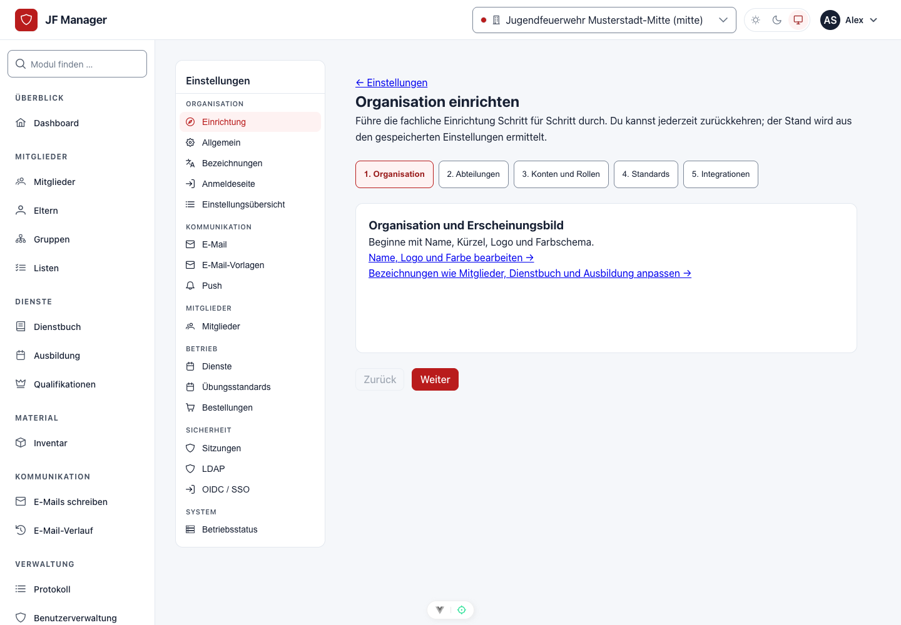

# Administratoren

Dieser Bereich behandelt Konten und fachliche Einrichtung in der Weboberfläche. Für Installation, TLS, Hauptschlüssel und Sicherungen ist [Server & Operations](../server/index.md) zuständig. Die Standardrolle Systemadministration enthält keine allgemeine Fachbearbeitung; zusätzliche Fachrollen werden ausdrücklich zugewiesen.

## Erste Einrichtung

1. Vom Serverteam Adresse und erstes Administrationskonto erhalten. Persönlich anmelden und die verpflichtende Mehrfaktor-Anmeldung einrichten.
2. **Einstellungen → Einrichtung** öffnen und den gespeicherten Stand prüfen.
3. Organisationsname, Logo und Farbe unter **Allgemein** festlegen. Nur öffentlich geeignete Branding-Dateien verwenden.
4. Abteilungen anlegen, sofern ihr Daten und Zuständigkeiten trennen wollt. Eine Organisation ohne Abteilungen ist ebenfalls möglich.
5. Persönliche Konten anlegen und passende [Rollen](roles.md) mit Wirkungsvorschau zuweisen.
6. Mitgliedergruppen, Anwesenheitsstatus, Ereignisarten, Qualifikationstypen und weitere Fachstammdaten mit den zuständigen Fachrollen prüfen.
7. Zeiten und Modulnamen unter [Einstellungen](settings.md) festlegen, danach optional SMTP, SSO oder Synchronisation einrichten.
8. Mit einem normalen Fachkonto die Sichtbarkeit, Abteilung und erlaubten Aktionen prüfen. Nicht nur das unbeschränkte Superuserkonto testen.

*Der Assistent zeigt den gespeicherten Stand und führt zu den passenden Verwaltungsseiten. Das Öffnen ändert keine Daten.*

## Konten verwalten

Öffne **Benutzer** in der Verwaltung. Lege ein persönliches Konto mit den angebotenen Pflichtangaben an; prüfe Aktivstatus und Anmeldemethode. Ein Staff-Kennzeichen ist keine Fachrolle. Ordne Rechte über **Rollen** zu und lasse die Person selbst Standard-Abteilung, Signatur und Anmeldefaktoren pflegen.

Deaktiviere einen nicht mehr benötigten Zugang und prüfe seine wirksamen Rollen und externen Quellen. Bei extern verwalteten Konten muss die Sperrung auch zum Verzeichnis oder Identitätsanbieter passen. Erhaltene fachliche Historie nicht als Nebeneffekt eines Rechteentzugs löschen.

## Sicherheitsaufgaben

- Verlange persönliche Zugänge; prüfe über **Warum darf diese Person das?** die tatsächliche Herkunft von Rechten.
- Vor Rollen-, Konto- oder Integrationsänderungen fordert die Oberfläche gegebenenfalls eine erneute Anmeldebestätigung. Bestätige die geprüfte konkrete Aktion.
- Bei Verlust eines Faktors zuerst Identität klären. Die Webaktion zum MFA-Reset gilt für normale Konten; privilegierte Konten werden ausschließlich am Host zurückgesetzt. Siehe [Notfallhilfe](../server/emergency.md).
- Prüfe **Protokoll** bei unklaren Änderungen und den [Betriebsstatus](settings.md#betriebsstatus). Beziehe bei Exporten und Anhängen nur die erforderlichen Personen und Daten ein.

## Weitere Aufgaben

[Rollen und Delegation](roles.md) · [Einstellungen und Stammdaten](settings.md) · [SSO, E-Mail und Synchronisation](integrations.md)
