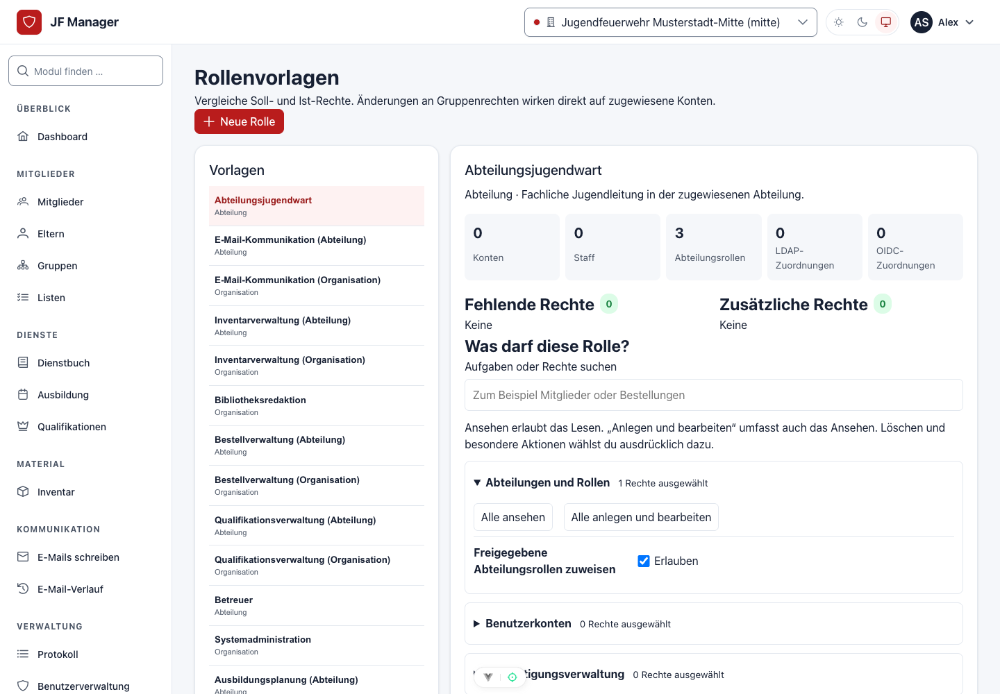
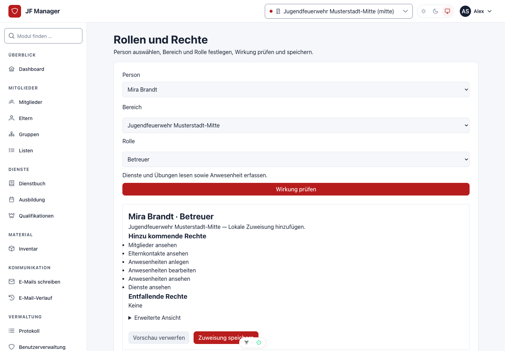

# Rollen und Berechtigungen

Stand: 06.10.2026. Die folgende Übersicht erklärt die 16 ausgelieferten Vorlagen. Rollen addieren sich innerhalb des zugewiesenen Bereichs. Systemadministration verwaltet Konten, Integrationen und Konfiguration; fachlichen Zugriff erhält sie durch zusätzliche Rollen. Staff allein ist kein Fachrecht.

## Einer Person eine Rolle geben

1. Mit einem berechtigten Konto **Rollen** öffnen (`/roles`). Administrierende und delegierende Leitungen benötigen Mehrfaktor-Anmeldung. Falls die Bestätigung abgelaufen ist, fordert die Anwendung vor einer geschützten Aktion eine erneute Bestätigung an.
2. **Person** auswählen. Das eigene Konto steht nicht zur Auswahl. Delegierende können privilegierte Konten nicht bearbeiten.
3. **Bereich** auswählen: eine erlaubte Abteilung oder, ausschließlich administrativ, die Organisation.
4. **Rolle** auswählen. Die Liste enthält nur Rollen, die in diesem Bereich zugewiesen werden dürfen.
5. **Wirkung prüfen** wählen. Person, Bereich, Beschreibung und hinzukommende Rechte kontrollieren. Lesbare Bezeichnungen sind die Standardansicht; technische Namen stehen unter **Erweiterte Ansicht**.
6. Die geprüfte Zuweisung bestätigen. Erst diese Aktion speichert. Wurde zwischenzeitlich ein Recht oder eine Zuweisung geändert, wird nichts gespeichert: die Wirkung erneut prüfen. Eingaben bleiben bei Fehlern erhalten.

Unter **Warum darf diese Person das?** zeigt die Anwendung Rollen, Bereiche, Rechte und Herkunft. Alle angemeldeten Personen können ihre eigenen Rechte ansehen. Leitungen sehen fremde Rollen ausschließlich in ihren erlaubten Abteilungen; die Systemadministration kann die vollständige Zuordnung prüfen.

## Delegation freigeben

In **Rollenvorlagen** (`/role-templates`) prüft die Systemadministration Beschreibung, Bereich und tatsächliche Berechtigungen. Die Option **Abteilungsleitungen dürfen diese Rolle nach Freigabe zuweisen** bedeutet: Berechtigte Leitungen können diese Rolle an andere Personen ihrer Abteilung vergeben, ohne deren Rechte verändern zu dürfen. Das Aktivieren der Option allein erteilt noch keine Freigabe. Eine dafür vorgesehene Abteilungsrolle benötigt eine ausdrückliche **Für Abteilungsleitungen freigeben**-Aktion. Die Freigabe gilt für genau die aktuelle Gruppe, ihren Bereich und ihre Rechte. Änderungen, auch über die technische Gruppenverwaltung, machen die Freigabe unwirksam. Organisations-, administrative und anonymisierende beziehungsweise löschende Rollen werden nicht als untergeordnete Fachrolle freigegeben.

Der Jugendwart kann Abteilungsjugendwarte und freigegebene untergeordnete Rollen zuweisen. Der Abteilungsjugendwart kann freigegebene Fachrollen seiner Abteilung zuweisen. Organisationsrollen einschließlich Jugendwart und Systemadministration vergibt ausschließlich die Systemadministration. Jugendleiter und Betreuer besitzen selbst kein Delegationsrecht.

## Eine neue Rolle anlegen oder eine Vorlage nutzen

In **Rollenvorlagen** **Neue Rolle** wählen. Anzeigename, Beschreibung und Bereich eintragen, Rechte in den Aufgabenbereichen auswählen. **Alle ansehen** oder **Alle anlegen und bearbeiten** wählt die passenden Rechte eines Bereichs gemeinsam; Löschen und Sonderaktionen bleiben getrennt. Einzelne Aufgaben können weiterhin angepasst werden. Die Suche findet vertraute Begriffe wie Mitglieder oder Bestellungen. Anschließend die Auswahl prüfen und **Rolle anlegen** bestätigen. Für eine Organisationsrolle ergänzt die Anwendung die Organisationssicht; die Fachrechte werden ausdrücklich gewählt. Der technische Schlüssel wird automatisch erzeugt und bleibt unter **Erweiterte Ansicht** optional anpassbar.

*Die Rollenvorlagen zeigen Aufgaben und Bereiche. Beim Bearbeiten bleiben Löschen und Sonderaktionen getrennt auswählbar.*

Die neu angelegte Rolle erscheint sofort in der Vorlagenliste. Die Zuweisungszahlen zeigen, dass dadurch noch niemand Rechte erhalten hat.

Für eine Rolle mit ähnlichen Aufgaben die bestehende Vorlage auswählen und **Vorlage kopieren** wählen. Name und Beschreibung anpassen und **Kopie anlegen** bestätigen. Die neue Rolle übernimmt die aktuellen Gruppenrechte und den Bereich, erhält aber keine Personen- oder Abteilungszuweisungen und keine Delegationsfreigabe. Mehrere Kopien können ohne technische Namenskonflikte angelegt werden. Anschließend die Rechte prüfen und bei Bedarf anpassen, danach delegierbare Abteilungsrollen ausdrücklich freigeben.

*Die Zuweisungsseite führt von Person und Bereich über die Wirkungsvorschau zur Bestätigung. Alle Daten im Bild sind fiktiv.*

## Rechte einer bestehenden Rolle ändern

Eine Vorlage auswählen und unter **Was darf diese Rolle?** die Aufgaben anpassen. Anlegen und Bearbeiten ergänzt das Ansehen; beim Abschalten der Bearbeitung bleibt vorhandenes Ansehen erhalten. Teilweise ausgewählte Rechte werden gekennzeichnet. Zusätzliche Rechte bleiben erhalten und können in **Erweiterte Ansicht** einzeln geprüft werden. **Auswahl prüfen und übernehmen** bestätigt die gesamte Auswahl für alle bisherigen Zuweisungen. Technische Gruppennamen stehen unter **Erweiterte Rollendaten**.

## Entfernen und Herkunft verstehen

Die Erklärung kennzeichnet **Lokal**, **LDAP** und **OIDC**. Eine lokale Rolle wird über die angezeigte Entfernung mit Wirkungsvorschau entfernt. Besteht dieselbe Rolle zusätzlich aus einer externen Quelle, zeigt die Vorschau, dass diese wirksam bleibt. Eine externe Rolle wird über das zugehörige Mapping beziehungsweise den Anbieter entzogen; lokales Entfernen überschreibt sie nicht. LDAP- und OIDC-Quellen sind voneinander unabhängig. Mappinglöschung entzieht ihre eigenen Quellen unmittelbar. Bei fehlender Gruppenzugehörigkeit wirkt die konfigurierte Entzugsregel beim nächsten erfolgreichen Login.

Archivieren verhindert neue Zuweisungen und erhält bestehende Rechte. Für einen Entzug deshalb die einzelnen Zuweisungen beziehungsweise externen Mappings bearbeiten. Vorlagen duplizieren erzeugt eine eigenständige, noch nicht freigegebene Rolle. Rechteänderungen einer bereits zugewiesenen Gruppe wirken unmittelbar auf deren Personen; vorher den Soll/Ist-Vergleich und die Zuweisungszahlen prüfen.

## Fachliche Bereiche

| Aufgabe | Passende Rolle und Grenze |
| --- | --- |
| Anwesenheit erfassen | Betreuer; Dienste und veröffentlichte Übungen der eigenen Abteilung lesen, keine Stammdatenbearbeitung. |
| Material ausgeben/rücknehmen | Inventarverwaltung; minimale Personenauswahl, Lagerbewegungen und nachvollziehbare Gegenbuchungen im eigenen Bereich. |
| Bestellung und Wareneingang | Bestellverwaltung; Bestellung, Artikel und Eingangslager werden auf den tatsächlichen Bereich geprüft. Das Eingangsrecht erlaubt keine beliebigen Inventarbuchungen. |
| Zentrale Kleiderkammer | Organisationsvariante Inventarverwaltung; kann Mitglieder aller Abteilungen auswählen. Organisationssicht allein genügt nicht. |
| Übungen planen | Ausbildungsplanung; Entwürfe und Planung im eigenen Bereich. Bibliotheksredaktion verwaltet die gemeinsame Bausteinbibliothek. |
| E-Mail senden | Separate E-Mail-Kommunikation; keine SMTP-/SSO-Konfiguration. |
| Konten und Integrationen verwalten | Systemadministration; Fachmodule zusätzlich zuweisen. |

Beispiel: Jugendleiter in Abteilung A plus Inventarverwaltung in B erlaubt Mitgliederdaten in A und Inventaränderungen in B. Eine zusätzliche Organisationssicht erweitert das Inventarschreibrecht aus B nicht. Zentrale Artikelkataloge sind fachlich lesbar, Änderungen verlangen ein globales Fachrecht.

## Die 16 Standardrollen

| Vorlage | Bereich | Für welche Aufgaben? |
| --- | --- | --- |
| Jugendwart | Organisation | Fachliche Leitung über Abteilungen, einschließlich Export und Delegation |
| Abteilungsjugendwart | Abteilung | Fachliche Leitung im eigenen Bereich, einschließlich Export und Delegation |
| Jugendleiter | Abteilung | Mitglieder/Eltern lesen, Listen und Dienste bearbeiten, Übungen planen |
| Betreuer | Abteilung | Stammdaten und veröffentlichte Dienste/Übungen lesen, Anwesenheit erfassen |
| Inventarverwaltung | Abteilung | Ausstattung, Lager und Ausleihen im Bereich verwalten |
| Inventarverwaltung (Organisation) | Organisation | Zentrale Ausstattung einschließlich Personenauswahl über Abteilungen |
| Bestellverwaltung | Abteilung | Beschaffung und Wareneingang im Bereich |
| Bestellverwaltung (Organisation) | Organisation | Beschaffung und Wareneingang über Abteilungen |
| E-Mail-Kommunikation | Abteilung | Mitglieder lesen, Nachrichten versenden und Verlauf prüfen |
| E-Mail-Kommunikation (Organisation) | Organisation | Kommunikation über Abteilungen |
| Ausbildungsplanung | Abteilung | Übungen und Gruppenplanung im Bereich |
| Ausbildungsplanung (Organisation) | Organisation | Übungen über Abteilungen planen |
| Bibliotheksredaktion | Organisation | Gemeinsame Ausbildungsbausteine, Kategorien und Tags |
| Qualifikationsverwaltung | Abteilung | Nachweise und Sonderaufgaben im Bereich |
| Qualifikationsverwaltung (Organisation) | Organisation | Nachweise und Sonderaufgaben über Abteilungen |
| Systemadministration | Organisation | Konten, Abteilungen, Rollen und Konfiguration; Fachrollen separat |

Beispiel für zwei getrennte Aufgaben: Eine Jugendleiterin, die zusätzlich Eltern anschreibt, erhält Jugendleiter und E-Mail-Kommunikation für dieselbe Abteilung. Für eine Person in der zentralen Kleiderkammer genügt je nach Auftrag die Organisationsvariante Inventarverwaltung; sie braucht nicht pauschal Systemadministration.

Bestehende Gruppen werden bei einem Update nicht automatisch zu Standardrollen erweitert. Katalogänderungen ausdrücklich vergleichen und übernehmen. [Technische Upgrade- und Abgleichanleitung](../../domains/roles-and-permissions.md#installation-und-bestehende-gruppen) enthält die Verfahren für Altbestände.
