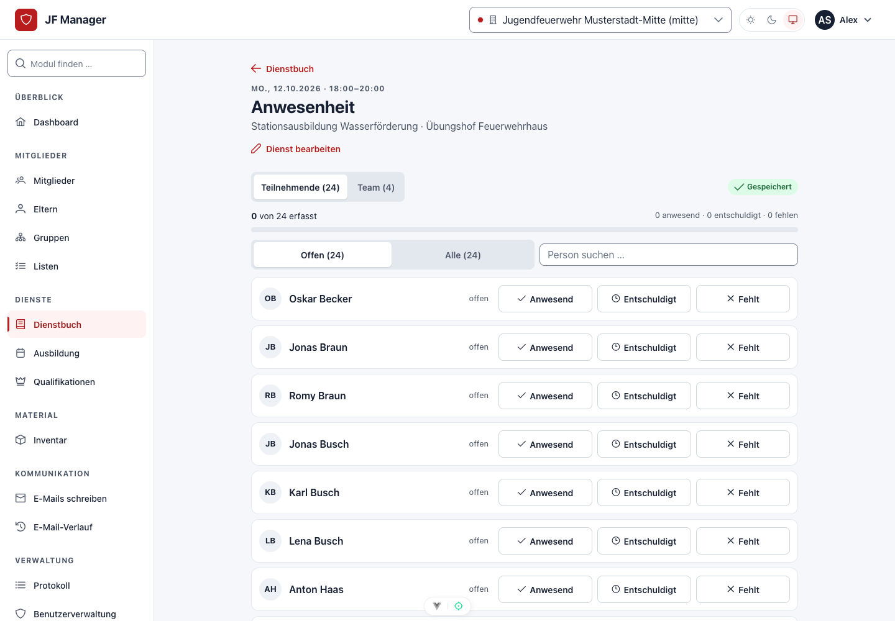
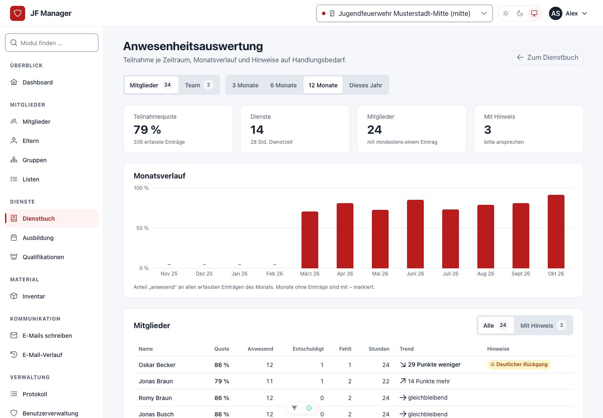

# Dienstbuch und Anwesenheit

## Dienstbuch und gemeinsame Anwesenheitserfassung

### Einen Dienst dokumentieren

Öffne **Dienstbuch** und erstelle einen Dienst mit Beginn, Ende, Ort und Thema. Ergänze Übungsleitung, Beschreibung und besondere Vorkommnisse, soweit erforderlich. Nach dem ersten Speichern steht die Anwesenheitserfassung für diesen Dienst zur Verfügung. Vorhandene Dienste kannst du über die Übersicht wieder öffnen und bearbeiten.

Die **Übungsleitung** beschreibt die verantwortlichen Personen. Die Anwesenheit von Jugendleitern und Ausbildern wird zusätzlich erfasst: Eine Zuordnung zur Übungsleitung setzt niemanden automatisch auf „anwesend“.

### Jugendliche erfassen

Wähle im Anwesenheitsbereich **Jugendliche**. Suche nach einem Namen oder aktiviere **Nur noch nicht erfasst**, um die offenen Personen nacheinander abzuarbeiten.

| Schaltfläche | Bedeutung |
| --- | --- |
| **A** | Anwesend |
| **E** | Entschuldigt |
| **F** | Fehlend |
| Keine Auswahl | Noch nicht erfasst |

Ein Antippen speichert die Auswahl sofort. Tippe denselben Status erneut an, um ihn zurückzusetzen. Die Zähler zeigen anwesende, entschuldigte, fehlende und noch offene Personen. **Nicht erfasst** wird nicht automatisch als **fehlend** gewertet.

Während des Speicherns ist die betroffene Zeile kurz beschäftigt. Andere Personen können weiter bearbeitet werden. Du musst nach jedem Eintrag keine vollständige Liste speichern.

### Jugendleiter und Ausbilder erfassen

Wechsle zu **Jugendleiter / Ausbilder** und verwende dieselben Schaltflächen. Die Teamliste basiert auf aktiven Benutzerkonten. Bei einem Dienst mit Abteilung werden zugehörige Benutzer dieser Abteilung berücksichtigt; bereits erfasste aktive Teammitglieder bleiben in der Dienstliste sichtbar.

Fehlt jemand, lasse das Benutzerkonto und die Abteilungszuordnung durch die Administration prüfen. Jugendliche und Teammitglieder bleiben getrennt, auch wenn Namen ähnlich sind.

### Mit mehreren Geräten gleichzeitig arbeiten

Mehrere Jugendleiter können denselben Dienst gleichzeitig öffnen und unterschiedliche Personen abhaken. Die Anwendung gleicht den Stand **alle drei Sekunden** mit dem Server ab. In nicht sichtbaren Browser-Tabs pausiert der regelmäßige Abgleich und wird beim Zurückkehren wieder aufgenommen.

Jeder Speichervorgang verändert nur die ausgewählte Person. Ändert eine andere Person inzwischen denselben Eintrag, weist die Anwendung auf den Konflikt hin und lädt den aktuellen Stand. Prüfe diesen und wähle den gewünschten Status anschließend erneut. Dadurch überschreibt eine veraltete Ansicht nicht stillschweigend eine neuere Änderung.

Beachte die Statuszeile: Bei unterbrochener Verbindung wird der Abgleich erneut versucht. Fehlgeschlagene Änderungen werden nicht als gespeichert behandelt. Es gibt keine Warteschlange für Offline-Einträge.

### Anwesenheiten auswerten

1. Öffne **Dienstbuch → Auswertung** (eigene Ansicht „Anwesenheitsauswertung“).
2. Wähle **Mitglieder** oder **Team** sowie den Zeitraum: 3, 6 oder 12 Monate beziehungsweise dieses Jahr.
3. Prüfe Kennzahlen und Monatsverlauf. Mit **Mit Hinweis** grenzt du die Personenliste auf Auffälligkeiten ein.
4. Vergleiche Quote, erfasste Status, Stunden und Trend; prüfe bei Rückfragen die einzelnen Dienste.

*Die Auswertung fasst erfasste Anwesenheiten zusammen. Hinweise sind Gesprächsanlässe, keine automatische Bewertung einer Person.*

Die Quote ist **anwesend geteilt durch alle erfassten Einträge**. Entschuldigte und fehlende Einträge zählen im Nenner; nicht erfasste Einträge zählen nicht. Stunden entsprechen der Dienstdauer bei Anwesenheit, ohne individuelle Ankunfts- oder Pausenzeiten. Die Dienstzeit-Kennzahl bezeichnet die Summe der Dienstdauern, keine Summe der Personenstunden.

Der Trend vergleicht die frühere mit der späteren Hälfte der eigenen Einträge; jede Hälfte braucht mindestens vier Einträge. Hinweise erscheinen bei unter 50 % Quote ab vier Einträgen, mindestens 25 Prozentpunkten Rückgang oder mindestens drei zuletzt nicht anwesenden Einträgen. Auch entschuldigte Einträge zählen in dieser Serie. Prüfe deshalb Gründe und Datenvollständigkeit, bevor du Schlüsse ziehst. Ausgewertet werden nur Dienste, deren Anwesenheiten du sehen darfst.

Für einzelne Mitglieder findest du den Verlauf zusätzlich im Mitgliederprofil unter **Anwesenheit**.
