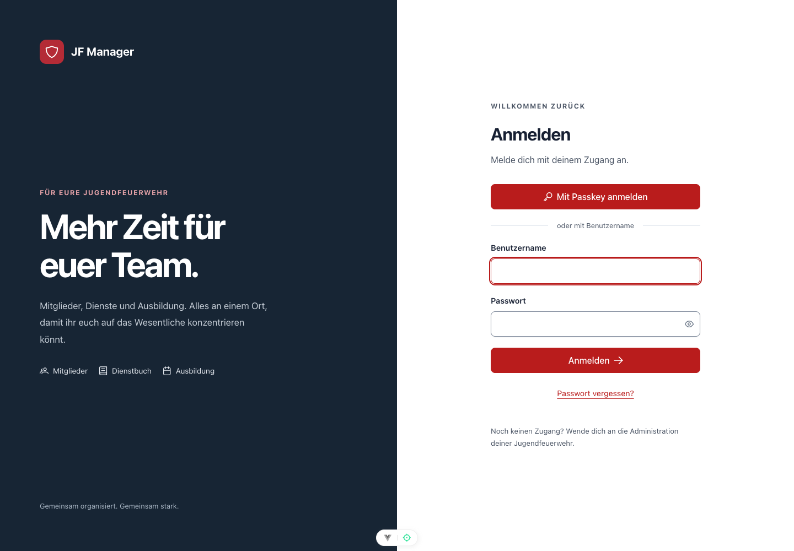
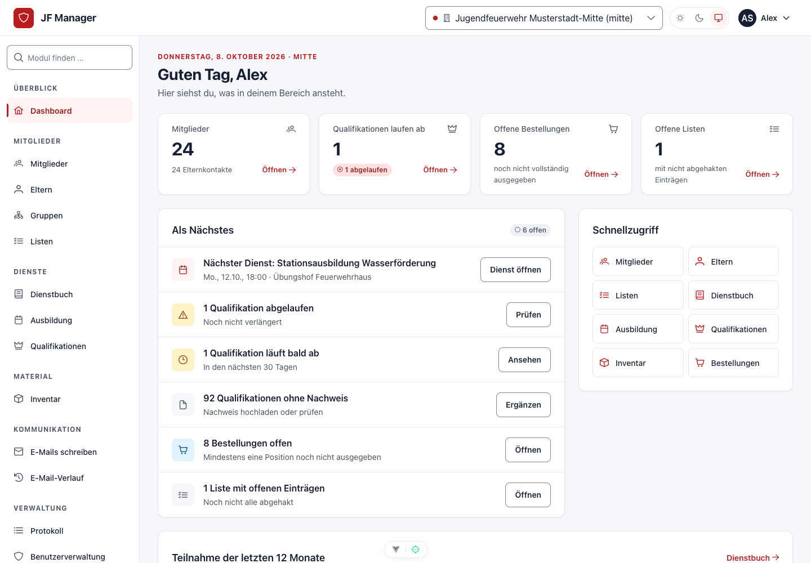
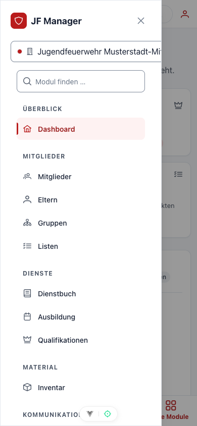
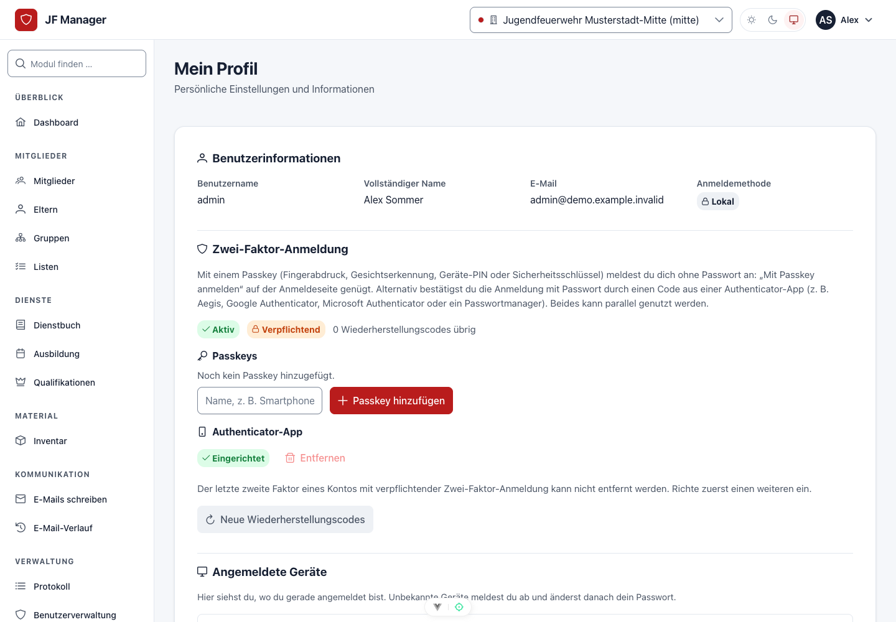

# Start und mobile Bedienung

## In fünf Minuten starten

1. Öffne die Adresse eures JF-Managers und melde dich mit deinem persönlichen Konto an.
2. Wähle gegebenenfalls eure Abteilung. Im Profil kannst du eine Standard-Abteilung hinterlegen.
3. Öffne **Mitglieder** und prüfe, ob die Jugendlichen und ihre Gruppen richtig zugeordnet sind.
4. Öffne **Dienstbuch**, lege einen Dienst an und speichere ihn. Danach kannst du die Anwesenheiten erfassen.
5. Öffne **Mein Profil → App & Mitteilungen**, wenn du die Anwendung installieren oder Push-Mitteilungen aktivieren möchtest.

## Anmelden und zurechtfinden

Gib Benutzername und Passwort ein und wähle **Anmelden**. Hast du im Profil unter **Zwei-Faktor-Anmeldung** einen Passkey hinzugefügt, genügt **Mit Passkey anmelden**: Das Gerät fragt Fingerabdruck, Gesicht oder Geräte-PIN ab, Benutzername, Passwort und Code entfallen (gilt für lokale Konten; bei LDAP- und SSO-Konten bestätigt der Passkey die Anmeldung als zweiter Faktor). Wenn eure Organisation Single Sign-On eingerichtet hat, steht zusätzlich die konfigurierte externe Anmeldung zur Verfügung. Bei einem lokalen Konto hilft der Link zum Zurücksetzen des Passworts. Bei extern verwalteten Konten änderst du das Passwort beim jeweiligen Identitätsanbieter.

Am Computer stehen die Module in einer dauerhaften Seitenleiste. Auf dem Smartphone findest du häufige Ziele unten; **Alle Module** oder **Module** öffnet die vollständige Navigation. Über die Modulsuche findest du auch selten verwendete Bereiche. Das Benutzermenü führt zu deinem Profil, dem Farbschema und **Abmelden**.

### Abteilungen und Berechtigungen

Der Abteilungswechsel legt den Arbeitskontext fest. Prüfe ihn vor dem Anlegen von Daten und bei scheinbar fehlenden Einträgen. Je nach Rolle kannst du eine oder mehrere Abteilungen auswählen; organisationsweit berechtigte Benutzer können zusätzlich abteilungsübergreifend arbeiten.

Ansehen, Anlegen, Bearbeiten und Löschen können unterschiedliche Rechte erfordern. Ein sichtbarer Datensatz bedeutet deshalb nicht automatisch, dass du ihn ändern darfst. Fehlt eine benötigte Aktion, wende dich an eure Administration. Verwende persönliche Konten statt eines gemeinsam geteilten Logins.

| Bereich | Typische Aufgabe |
| --- | --- |
| Mitglieder, Eltern, Gruppen | Stammdaten und organisatorische Zuordnung pflegen |
| Listen | Teilnehmer-, Rücklauf- oder Checklisten führen |
| Dienstbuch | Dienste dokumentieren und Anwesenheiten erfassen |
| Ausbildung, Bibliothek | Termine und Ausbildungsinhalte planen |
| Inventar, Bestellungen | Ausstattung ausgeben, Bestände und Beschaffung verfolgen |
| Qualifikationen | Nachweise und Sonderaufgaben verwalten |
| E-Mail | Mitglieder und Eltern anschreiben, Versand prüfen |
| Verwaltung, Einstellungen | Konten, Rechte, Abteilungen und Konfiguration verwalten |
## Auf dem Smartphone installieren

Der JF-Manager kann als Web-App vom Startbildschirm geöffnet werden. Die produktive Adresse muss über **HTTPS** erreichbar sein. Installationsmöglichkeiten und Menübezeichnungen hängen vom Browser ab.

### Android und Desktop

Öffne **Mein Profil → App & Mitteilungen**. Wird **App installieren** angeboten, wähle die Schaltfläche und bestätige den Browserdialog. Alternativ öffne das Browsermenü und suche nach **App installieren** beziehungsweise einer vergleichbaren Installationsfunktion.

### iPhone und iPad

Öffne die Seite in Safari, wähle **Teilen → Zum Home-Bildschirm** und bestätige das Hinzufügen. Starte die Anwendung anschließend über das neue Symbol. Für Push-Mitteilungen auf unterstützten iPhones und iPads verwende diese installierte Web-App.

Die Installation ersetzt keine Internetverbindung: Daten laden und Änderungen speichern erfordern eine Verbindung. Die App speichert keine Offline-Änderungen zum späteren Übertragen.

## Push-Mitteilungen pro Gerät einstellen

Unter **Mein Profil → App & Mitteilungen** aktivierst du Mitteilungen freiwillig für das aktuelle Gerät und den aktuellen Browser:

1. Wähle **Dienste**, **Bestellungen** oder beide Kategorien.
2. Wähle **Mitteilungen aktivieren** und erlaube Mitteilungen im Browserdialog.
3. Wähle **Test senden**, um den Versand zu prüfen. Der Versand kann einen Moment dauern.
4. Ändere später die Kategorien und bestätige mit **Auswahl speichern**.
5. Mit **Ausschalten** deaktivierst du Push auf diesem Gerät.

**Dienste** betrifft neue oder geänderte Dienstbucheinträge. **Bestellungen** betrifft neue Bestellungen und Statuswechsel. Die Mitteilungen verwenden allgemeine Texte ohne Mitgliedernamen auf dem Sperrbildschirm. Öffne die Anwendung, um die berechtigten Details zu sehen.

Die Auswahl gilt nicht automatisch für weitere Geräte. Nach dem Abmelden musst du Push auf dem Gerät erneut aktivieren. Wenn der Browser Mitteilungen blockiert, korrigiere die Freigabe in seinen Einstellungen. Meldet das Profil, dass Push noch nicht eingerichtet ist, muss die Administration zuerst die Serverkonfiguration und den Versand einrichten. Geräteeinstellungen, Browserunterstützung und Verbindung können die Zustellung beeinflussen.

## Persönliches Profil

Im Benutzermenü öffnest du dein Profil. Pflege dort Standard-Abteilung und E-Mail-Signatur, prüfe deine Berechtigungen und verwalte Anmeldefaktoren. Das Farbschema bietet hell, dunkel und Systemeinstellung. Melde dich nach der Arbeit auf gemeinsam genutzten Geräten ab.
