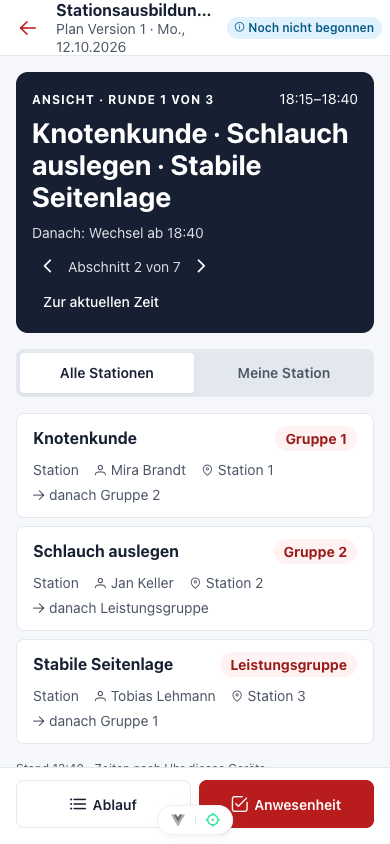

# Übungsplanung von der Idee bis zur Nachbereitung

Die **Ausbildung** zeigt einen Kalender mit allen gespeicherten Übungen. Lege eine Übung mit Datum, Beginn, Ende, Ort, Beschreibung und teilnehmenden Gruppen an. Im Planer stellst du den Ablauf aus Bausteinen zusammen: eigene Inhalte oder Bausteine aus der **Bibliothek**, je Gruppe in einer eigenen Bahn. Ein Baustein ohne Gruppe gilt für alle Gruppen. Änderungen sammelt der Planer als Entwurf; **Speichern** übernimmt den ganzen Plan auf einmal, **Rückgängig** und **Wiederholen** helfen beim Ausprobieren. Hat jemand anderes inzwischen gespeichert, bleibt dein Entwurf erhalten und du vergleichst ihn mit dem Serverstand.

*Ein gespeicherter Plan ordnet Abschnitte den Gruppen und Zeiten zu. Vor einer Änderung den Stand und den Übungsstatus prüfen.*

### Stationen, Ausbilder und Material

Im Baustein wählst du die **Art** (Baustein, Station, Wechsel, Pause, freie Runde) und ergänzt Ort, Lernziel, Sicherheitshinweise, **Ausbilder** und **Materialbedarf** (Artikel aus dem Inventar mit Variante und Menge oder ein freier Text). Materialbedarf ist reine Planung: Bestand und Ausleihen ändern sich dadurch nicht.

### Rotation

Mit **Rotation** planst du einen Stationsbetrieb in einem Schritt: Gruppen wählen (meist die Altersgruppen, die an diesem Abend dabei sind), Stationen in Reihenfolge anlegen – auf Wunsch direkt **aus der Bibliothek** –, Stationsdauer, Wechselzeit und optional eine Pause festlegen. Die Vorschau zeigt jede Runde mit Uhrzeit und welche Gruppe wo ist; gibt es mehr Stationen als Gruppen oder umgekehrt, erscheinen freie Runden und unbesetzte Stationen ausdrücklich. Übernommen wird alles als ein Schritt, den **Rückgängig** wieder entfernt.

Die Bausteine einer Station sind **verknüpft**: Änderst du Station 1 für eine Gruppe, gilt die Beschreibung für alle Gruppen – du schreibst sie nur einmal. Zeiten und Gruppen bleiben je Baustein. Braucht eine Altersgruppe eine eigene Ansprache, setze im Baustein **Nur für diese Gruppe ändern (Verknüpfung lösen)**.

### Planungswarnungen und Veröffentlichen

Der Planer prüft den Entwurf laufend auf überlappende Gruppen, doppelt eingeplante Ausbilder und Orte (auch in anderen Übungen desselben Tages) und rechnerischen Materialmangel. Der Bereich **Planungswarnungen** ist eingeklappt; **Anzeigen** listet die Warnungen mit Sprung zum Baustein. Warnungen verhindern das Speichern nicht. Wer trotz Warnungen **Veröffentlicht**, gibt eine kurze Begründung an. Übungen, die du nicht planen darfst, erscheinen nur anonym.

Mit dem Veröffentlichen entsteht im **Dienstbuch** der zugehörige Dienst. Ein Klick auf einen Dienstbucheintrag öffnet wie gewohnt **Dienst bearbeiten**; zur Übung gelangst du über den Kalender oder das Kalendersymbol am Eintrag.

### Serien, Vorlagen und Kopien

**Serie** ergänzt fehlende Termine einer wiederkehrenden Übung nach einer vollständigen Vorschau; vorhandene Termine, Dienste und Anwesenheiten bleiben unberührt. **Dieser und folgende** überträgt einen gespeicherten Stand auf spätere Termine; abweichende oder bereits gehaltene Termine bleiben, sofern du sie nicht ausdrücklich einbeziehst. Unter **Weitere Aktionen** speicherst du eine Übung als **Vorlage** oder **kopierst** sie auf ein anderes Datum; Kopien besitzen eigene Bilder und Anhänge.

### Durchführen

Am Übungstag startest du über **Durchführen** – auf der Heute-Karte im Dienstbuch, im Planer oder in der mobilen Planansicht. Die Ansicht ist für das Telefon gemacht: oben der aktuelle Abschnitt mit Restzeit und was danach kommt, darunter alle Stationen mit der Gruppe jetzt und danach, Ort und Ausbildern. **Meine Station** zeigt dir als Ausbilder deine Station mit Lernziel, Ablauf, Sicherheit und einer Materialliste zum Abhaken. Das Abhaken gilt nur auf deinem Gerät. Mit den Pfeilen blätterst du durch die Abschnitte, ohne etwas zu ändern; die aktuelle Zeit stammt von der Uhr deines Geräts.

Die Ansicht aktualisiert sich jede Minute und nach einer Unterbrechung der Verbindung. Ohne Verbindung siehst du einen Hinweis mit dem Stand der letzten Aktualisierung; Änderungen sind dann nicht möglich. Hat jemand den Plan geändert, meldet die Ansicht die neue Version. **Anwesenheit** führt zur Erfassung im Dienstbuch.

*Die Durchführung zeigt den gespeicherten Ablauf. Die Uhr des Geräts bestimmt den aktuellen Abschnitt.*

### Nachbereiten

Nach Beginn der Übung öffnest du **Nachbereiten** im Planer oder in der Durchführung. Trage den tatsächlichen Beginn und das Ende ein (**Planzeit übernehmen** hilft), dazu eine kurze Reflexion und Verbesserungshinweise. Die Planzeit bleibt unverändert; angezeigt wird der Unterschied. Mit **Übung zugleich abschließen** schließt du die Übung im selben Schritt ab; Anwesenheiten bleiben im Dienstbuch. Hat jemand anderes die Nachbereitung inzwischen geändert, siehst du beide Stände und entscheidest, welcher gilt.

### Handout

Das **Handout** (Drucken oder PDF) enthält Version und Stand, den Ablauf, je Station eine Karte mit Ort, Ausbildern, Zeitfenstern und Gruppen, Lernziel, Sicherheit und Material sowie eine zusammengefasste Materialliste. Material einer Station zählt dort einmal, weil die Gruppen nacheinander üben.

### Bibliothek

In der Bibliothek pflegst du wiederverwendbare Inhalte mit Kategorien, Tags und einer Standarddauer. Ein Bibliotheksbaustein wird beim Einfügen in die Übung kopiert; spätere Änderungen in der Bibliothek verändern geplante Übungen nicht.
